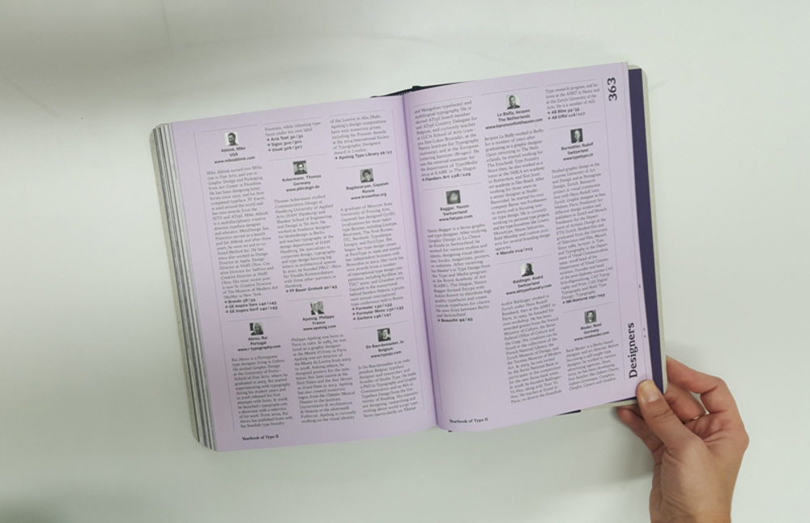

# Untersuchung · Schriftmuster (Papier)

## Cast

::: margin
### Inhaltliche Teile

* Einleitung / Informationstext
* Alle 467 Glyphen in 24pt, Cast Regular
* Schriftschnitte Light, Regular, Medium, Bold, Heavy und Black
* Opentype-Features
* «The quick brown fox jumps over the lazy dog.»
* Infotext in verschiedenen Schriftschnitten und -grössen
* Formale Details

### Zweck und Analyse
Zum Einen fungiert das Papier-Schriftmuster als Plakat, welches die Schrift «Cast» anteasert. Zum Anderen werden die Spezifikationen und Anwendungen der Schrift kurz, bündig und übersichtlich auf den Punkt gebracht. Die Einleitung informiert über kurz über die Schrift, ihren Schöpfer Domonique Kerber und deren Entstehung von 2007 bis 2011 an der ZHdK.

:::

## Dalton Maag
::: margin
### Inhaltliche Teile
* Schriftname und Auflistung der Schriftschnitte
* Übersicht aller vorhandenen Glyphen
* Beschreibung der Schrift, besonderen Merkmale und ihr Anwendungsgebrauch

### Zweck und Analyse
Ist in ihrer Art und Weise kein klassisches Schriftenmuster, sondern dient mehr als ein Image- bzw. Designprodukt für Dalton Maag. Mittels wenig Text werden besondere Merkmale der Schrift nur kurz angeschnitten, der Gedanke hinter der Herstellung sowie ihr Anwendungsbereich beschrieben. Der Hauptinhalt besteht in einer Wiederholung des Beschreibungstexts und unterscheidet sich untereinander in Grösse, Satzbreite und Schriftschnitt. Einige Seiten sind in der Gestaltung offen und besitzen mehr einen künstlerischen Wert und helfen mit ihrer visuellen Darstellung nicht wirklich der Schriftauswahl.

:::

## Diplomstudiengang ZHdK
::: margin
### Inhaltliche Teile
* Angaben zum Autor
* Gedanken und Ausgangslage
* Erstellungsprozess
* Symbolbibliothek
### Zweck und Analyse
Das kleine Büchlein beinhaltet 11 verschiedene Fonts, welche im Nachdiplomsstudiengang «CAS Schriftgestaltung 12/13» an der ZHdK als Diplomarbeit entstanden sind. Zweck dieser kleinen Sammlung ist das Endresultat der Diplomarbeit als Sammlung zu präsentieren. Im Zentrum stehen die Gedankengänge die zum Endresultat geführt haben. Die Fonts befinden sich alle noch am Anfang ihrer Entwicklung, einzelne wurden weiterverfolgt und werden heute zum Kauf angeboten. Ein Beispiel hierfür ist die Cast von Dominique Kerber.
:::

## Eames

::: margin
### Inhaltliche Teile
* Schnitte Auflistung
* Kurzgeschichte, Intention
* Fotos mit Anwendungen
* Gesetzter Text in Anwendungen
* Kombinationen mit Sonderzeichen als Deko-Elemente und diverse farbige Variationen
* Zeichenmuster

### Zweck
Der Verkauf der Schrift steht im Vordergrund.  
Die Dokumentation ermöglicht einen Einblick in viele mögliche Anwendungen diese Schriftfamilie.

### Analyse
Das ist keinen Schriftenmuster in klassischem Sinn. Eher eine vielfältige und spielerische Darstellung der Familienschrift Eames. Interessant ist die Abwicklung der Entstehungsgeschichte über mehrere Seiten. Als Weg mit Timeline abgebildet, zeigt der Weg wie kontinuierlich neue Elemente dazu gekommen sind.
:::

## Slanted Typography/Design
### Stencil.Type. – Winter 2009/10 – Issue 09

::: margin
### Inhaltliche Teile
* Section 1: Stencil Type  Vorstellung verschiedener Schablonen-Schriften
* Section 2: Miscellaneous  Interviews, diverse Arbeiten, Projekte von Studierenden
* Section 3: Blog Life  Abgedruckte Auszüge aus dem Web

### Zweck und Analyse
Das Magazin Slanted bietet Einblicke in aktuelle Arbeiten rund um die Themen Typografie und Design.  
Die Ausgabe Nummer 09 befasst sich mit dem Thema „Stencil-Fonts“. Im Hauptteil werden verschiedene Schablonen-Schriften vorgestellt, ausserdem gibt es in dieser Ausgabe aber auch verschiedene andere Beiträge, so z. B. eine Reportage, Interviews oder in der Rubrik „Fontnames Illustratet“ diverse illustrative Arbeiten.

:::

## Bibliothek SG
::: margin
### Inhaltliche Teile
* Inhalt (Kurzgeschichten)
* Schriftgeschichte

### Zweck und Analyse
Es handelt sich um ein Buch mit 5 Kurzgeschichten darin, einem Nachwort und einige Seiten über die Schrift des Buches.  
Es gibt 2 Anwender des Buches, die einen die gerne Lesen, den Autor mögen oder das Fachpublikum welches sich sehr für Schriften interessieren, diese Kaufen das Buch wegen den letzten paar Seiten «Zu dieser Schrift» da der Autor über ein enormes Wissen von Schrift verfügt.
Das Buch wurde mit Bleisatz gedruckt und bediente sich an der Schrift «French Old Style». Diese Schrift wurde im Jahr 1907/1908 entwickelt und hatte das Ziel die Effizienz der Satzherstellung zu steigern, besonders bei Zeitschriften und Zeitungen.

:::

## Offizin Haag-Drugulin
::: margin
### Inhaltliche Teile
*	Inhaltsverzeichnis ist nach Einsatz der Schriften und Schriftart unterteilt
*	Als Einstieg einen Einblick in die Geschichte der Schrift
*	Dann folgen die Schriftmuster. Jede Schriftart der Druckerei wird in verschiedenen Schriftgrössen, Schriftschnitten wie auch Gross- und Kleinschreibung aufgezeigt
*	Nur bei den Werkschriften sieht man jeweils den ganzen Glyphensatz
### Zweck
Dieses Buch diente der Druckerei als Vorzeigemuster für Kunden. Damit konnten Kunden sehen was die Druckerei alles für Schriften anbietet. So konnte man auch gleich zeigen was einem gefällt und was nicht.

### Analyse
Es fehlen Hintergrundinfos der Schrift: Wer hat sie erstellt?, wann?, was sind Merkmale?, usw.
Um einem Kunden eine Auswahl zeigen zu können eignet es sich gut aber sehr übersichtlich und strukturiert ist es nicht. Das Buch war natürlich sehr aufwendig zu erstellen und für diese Zeit ein tolles Aushängeschild für ein Geschäft.

:::

## Helvetica forever

::: margin
### Inhaltliche Teile
* Entstehung der Schrift
* Schriftentwicklung
* Durchbruch der Schrift
* Erfolg der Schrift
* spezielle Eigenschaften
* verbreitete Verwendung in Gestaltungsprojekten
* Konkurrenten

### Zweck und Analyse
Lars Müller veröffentlichte dieses Buch aus kommerziellem Interesse in Kooperation mit Linotype aber auch aus privatem Interesse und fleissiger Helvetica-Nutzer.

Im Hinblick zum 50-Jahr-Jubiläum der Schrift Helvetica hat Lars Müller die Geschichte der Helvetica in einem Buch verfasst. Darin wird einerseits die Entstehung, die Entwicklung, der Durchbruch und Erfolg beschrieben und welche speziellen Eigenschaften die Helvetica ausmacht. Andererseits zeigt er die verbreitete Verwendung von Helvetica in verschiedenen bekannten Gestaltungsprojekten. Ebenso verweist er auf viele ähnliche Schrift-Konkurrenten wie Beispielsweise die Akzidenz-Grotesk.
:::

## Fedra

::: margin
### Inhaltliche Teile
* Übersicht der Fedra Typefont nach den verschiednen Schnitten gegliedert.
* 100 verschiedene Kombinationen der Schnitte.
* Tabellarische Auflistung der Schnitte mit Beispielen der Schrift selber.
* Die Entstehung der Schrift wird erläutert.
* Verschiedene Versionen werden miteinander verglichen.
* Mehrsprachigkeit wird anhand einer Block Auflistung nebeneinander aufgezeigt.
* Der Font wird in effektiven Beispielen gezeigt.

### Zweck
Das Buch wird verwendet für eine Darstellung der Font Fedra. Es zeigt alle möglichen Zusammenstellungen der Schnitte sowie Typefaces auf. Es ist an Designer sowie Typografen gerichtet.

### Analyse
Die verschiedenen Arten die Schrift einzusetzen werden in diesem Buch klar aufgezeigt. Alle Schnitte können einfach miteinander verglichen werden. Zusätzlich erhält man wertvolle Informationen über die Herkunft sowie Herstellung der Schrift. Am Schluss des Buches gibt es viele Beispiele, wie und wo die Schrift bereits gebraucht wurde.
:::

## Year Book of Type 2

::: margin
### Inhaltliche Teile

* Einstieg: was, wie und wieso überhaupt
* Schriftarten: Doppelseite mit Schrift: links kann der Schriftdesigner den Raum nutzen um den Font nach seiner Wahl zu präsentieren, rechts findet man nähere detaillierte Informationen, Hintergrund zur Schrift, über den Designer, Klassifizerung und Anwendung in verschiedenen Schnitten
* Index: Auflistung aller gezeigten Schriften, Vergleich möglich
* Designer:  Verzeichnis aller im Buch genannten Font-Designer
### Zweck und Analyse
Das Buch ist 2015 erschienen und zeigt eine qualitativ hochwertige Auswahl an kürzlich erschienen Schriften. Bisher sind zwei Bände erschienen, das dritte ist in Arbeit. Das Ziel des Werkes ist der Vertrieb der gelisteten Schriften und dient als Inspiration und ist ein Hilfsmittel bei der Suche einer Schrift. Der Herausgeber vom Year Book of Type ist slanted und vertrieben wird es von niggli. Auf slanted.de wird man mit Inspiration über Fonts überschüttet, der Blog bietet auch reichlich an Informationen sowie gibt es die Magazine die 4x jährlich erscheinen. Trotzdem ist dieses Werk entstanden, um die Auswahl an Schriften in Printform darzustellen.
:::

## Stern

::: margin
### Inhaltliche Teile
* Geschichte der Entstehung, Hintergründe
* Verwendungsempfehlung
* Bleisatzbeispiel
* Open-Type Funktionen
* Alternate Glyphs
* Anzahl Sprachen
* Zeichenbibliothek
* Impressum
### Zweck und Analyse
Das kleine Booklet scheint sich an ein Fachpublikum zu richten, mit dem Zweck, die Idee und die Hintergründe der Schrift aufzuzeigen.
Schriftenliebhaber werden sicher die Fokusgruppe sein, an die sich das Booklet richtet. Der Zweck des Booklets wird wohl sein die Idee
einem Fachpublikum zu verkaufen und sie auf den Font aufmerksam zu machen. Aber sicher auch als Hommage an den Prozess, die Leute die
involviert waren und die innovative Idee, Bleisatz und Digitalfont gleichzeitig zu entwerfen.  
Das kleine Booklet ist aus meiner Sicht eine Darstellungsart, wie man sie am ehesten ins Web übertragen könnte. Knapp, prägnant, mit
klarer Struktur und vielen Bildern untermalt. Es wird mehr eine Geschichte erzählt und eben diese Geschichte mit dem Font zusammen verkauft,
als der Font alleine. So könnte ich mir am ehesten eine Präsentation im Web vorstellen, natürlich mit Interaktion angereichert. Diese Art
von Booklet halte ich für Schriften-Liebhaber und Designer eine gute Lösung, da das oft auch die Personen sind, die mehr wissen wollen
als nur, wie eine Schrift aussieht.
:::

