# Gestaltung ·  Navigations- und Ordnungskonzepte

::: TOC
**Content**
[[TOC]]
:::

## Navigations- und Ordnungskonzepte
Um den Inhalt einer Website möglichst einfach zugänglich zu machen, gibt es diverse Konzepte, diesen zu strukturieren und dem Benutzer eine einfache Navigation zu ermöglichen. Je nach Inhalt, Umfang und Verwendungszweck können verschiedene Konzepte angewendet werden. Nicht alleinig der Inhalt, sondern auch das Anzeigegerät kann eine entscheidende Rolle spielen, wie dies geschehen sollte. So wird bei einem Smartphone der Zugang durch einen kleinen Bildschirm über eine Fingersteuerung gewährleistet, während man bei einem Desktop-Computer mit der Maus auf einem grossem Bildschirm navigiert.

### Strukturieren der Inhalte in Seiten
Die meisten Websites gliedern Inhalte über Seiten. Meist wird auf einer Seite ein Thema, Artikel oder eine Einheite erläutert. Davon ausgehend werden dann Links und Bezüge zu anderen Seiten geschaffen.

 

::: margin wide
#### Mehrere Inhalte auf mehreren Seiten
:::

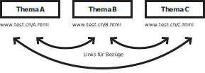

 
 

### Anwachsen der Themen ohne Struktur zu unterstützen
Wird ein Thema grösser, so können verschiedene Konzepte gewählt werden, wie nun die Information weiter strukturiert wird. Meist ungünstig ist eine Aufteilung, die eine bestehende Struktur nur aufteilt, ohne aber den Benutzer weiter in der Struktur zu unterstützen.

 

::: margin wide
#### «Paging» oft ungünstig
Inhalte werden in kleinere Teile verteilt, jedoch wird die Struktur der Inhalte nicht Unterstützt.
:::

### Anwachsen der Themen mit erweiterter Struktur
Wachsen einzelne Themen an, können auch Kategorien gebildet werden und somit eine Gruppierung der Inhalte. Damit wird eine zusätzliche Strukturtiefe eingezogen, jedoch mit dem Ziel die Struktur zu verstärken.

 

::: margin wide
#### Logische Einheiten
Die Hauptkategorie
umfasst mehrere Themen.
:::
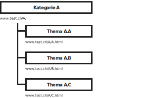

 

### Strukturtiefe
Je mehr Inhalte in Kategorien zusammen gefasst werden müssen, desto eher entsteht das Bedürfnis, mehr Kategorien und Unterkategorien zu erstellen.

::: margin wide
#### Unterkategoiren
Bei Webdesign spricht man von Levels, in die sich eine Struktur einteilen kann.
:::

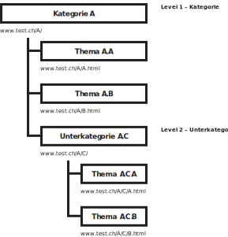

## Hierarchische Navigation
Viele kleinere Websites lassen sich sehr einfach über ein oder zwei Menü-Tiefen (Menü-Levels) steuern.

 
 

::: grid fullsize

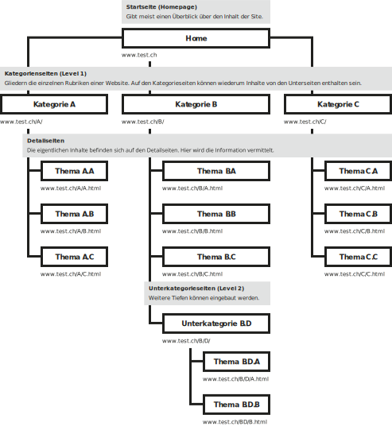

:::

### Hierarchische Inhalte darstellen
Es gibt diverse Ansätze um hierarchische Inhalte in einer Navigation ab zu bilden. Die Konzepte sind jedoch oftmals ähnlich.

 
 

::: margin wide
#### Abtrennen der Levels
Separate Navigations-Levels sind an verschiedenen Positionen angeordnet und optisch getrennt.
:::

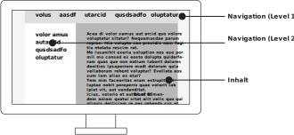

 

::: margin wide
#### Verschachtelte Levels
Die Navigation besteht aus einer Einheit. Durch einrücken wird die jeweilige nächste Navigationstiefe angezeigt.
:::

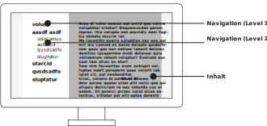

 

::: margin wide
#### Breadcrumb-Navigation (Brotkrümelnavigation)
Kommen diverse Hierarchien innerhalb der Seite vor, wird häufig eine Breadcrumb-Navigation dem Benutzer zusätzlich eingeblendet, so dass dieser immer Sieht, in welcher Kategoire und Unterkategorie er gerade ist und gegebenen Falles auch in der Hierarchie wieder zurück springen kann.
:::

## Metanavigation
Bei einer Metanavigation werden nicht die Hierarchien innerhalb der Seite berücksichtig, sondern es werden gewisse Teile des Inhalts bewusst gewählt und zusammen als separate Navigation ausgegeben.
Oft wird eine Metanavigation zur hierarchischen Navigation ergänzt.

 
 

::: grid fullsize
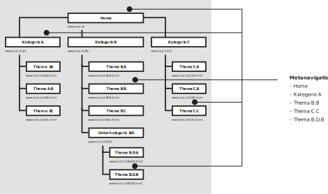
:::

 
 

::: margin wide
#### Optische Abtrennung von Hierarchie-Navigation
Um dem Benutzer die Metanavigation verständlicher zu machen, wird diese oftmals optisch abgetrennt.
:::

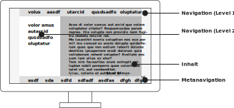

## Zeitliche Navigation
Werden viele Inhalte ohne erkennbare Struktur dargestellt, so kann eine Zeitliche Navigation – sofern der Inhalt dies zulässt – angebracht sein. Meist ist bei einer derartigen Navigation der aktuellste Eintrag (häufig nicht in Seiten strukturiert) am einfachsten zugänglich als am Anfang und weitere Einträge folgen durch eine Navigation.

 
 

::::: grid fullsize

:::: col_4of12
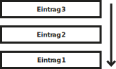
::::

:::: col_8of12_last
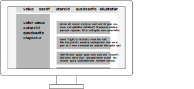
::::
:::::

::::: grid fullsize

:::: col_4of12
#### Timeline
Durch Scrollen oder verlinkung gelangt man zu den älteren Inhalten.
::::

:::: col_8of12_last
#### Posts geordnet nach Entstehung
Häufig werden Blogs oder Posts in sozialen Netzwerken mit absteigendem Datum sortiert.
::::
:::::

 
 
 

::::: grid fullsize space2

:::: col_6of12
::: imageline

:::
####  Posts geordnet nach Entstehung
Quelle: [Balthasar Glättli – Twitter](https://twitter.com/bglaettli)

::::

:::: col_6of12_last
::: imageline
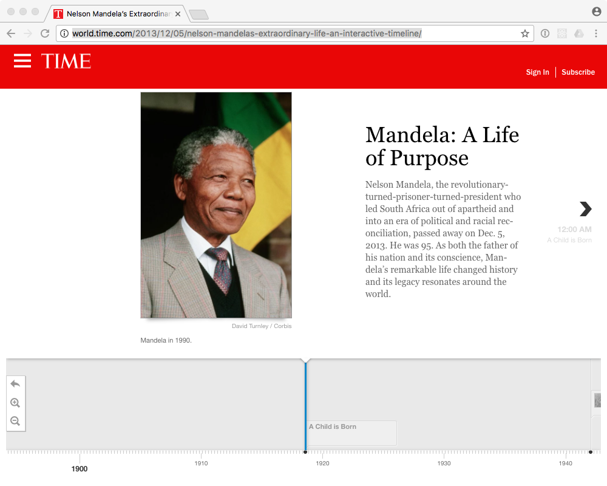
:::
#### Inhalt über zeitliche Positionierung zugänglich
Quelle: [Nelson Mandela – TIME.com](http://world.time.com/2013/12/05/)
nelson-mandelas-extraordinary-life-an-interactive-timeline/

::::
:::::

## Scroll-Navigation (Anker)
Bei Seiten mit überschaubarem Inhalt, kann es sein, dass mehrere Themen auf einer einzelnen Seite angeordnet werden. Die Navigation erfollt dann innerhalb der Seite nur durch scrollen. Um Themen direkt an zu springen, kann auch eine Text-Navigation zusätzlich eingeblendet sein.

 
 

::: margin wide
### Inhalte fortlaufend
Bei einer solchen Navigation sind die Inhalte nicht durch Seiten, sondern über die Position getrennt.
Die Navigation erfolgt dennoch über ein Menü, doch es wird kein Seitenwechsel, sondern ein Scroll ausgelöst.
:::

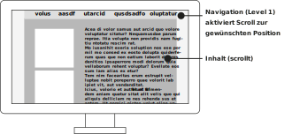

 
 

## Storrytelling durch scroll (Snow Fall)
Im Bereich des Journalismus gibt es diverse Ansätze durch die Interaktivon des scrollens eine journalistische Geschichte einfacher zugänglich zu machen. Solch aufbereitete Seiten entstehen oft ausserhalb des üblichen redaktionellen Prozesses und werden technisch und inhaltlich auf diese Art der Navigation optimiert.

::::: grid fullsize space2

:::: col_6of12
::: imageline

:::
####  Bildstrecken, interaktive Grafiken und Gallerien unterstützen den Text
Quelle: [Iouri Podladtchikov - NZZ.ch](http://iouri-in-sotschi.nzz.ch/)

::::

:::: col_6of12_last
::: imageline
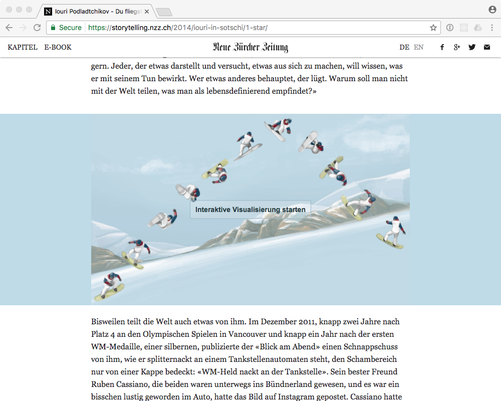
:::
::::
:::::

## Navigation auf mobilen Geräten
Um auf den kleinen Bildschirmen der mobilen Geräte nicht viel Platz durch die Navigation zu verlieren, wird das Menü meist vereinfacht und erst bei Anwahl des Menüs vollständig zugänglich gemacht.

 
 

::: margin wide
#### Hamburger-Menü mit Slideout
Als häufiges Symbol für die Navigation werden drei Striche verwendet. Damit das Icon auch von weniger netzaffinen Personen klar erkennt werden kann, empfiehlt sich dies zusätzlich an zu schreiben.
Das Menü bewegt sich von der Seite in den Bildschirm.
:::

::: grid w80p
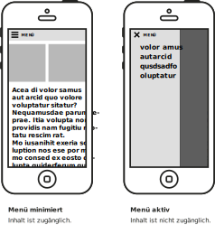
:::

 
 

::: margin wide
#### Slidedown-Menü
Das «Slidedown»-Menü mit Button ist für viele – auch ungeübte Benutzer – ein bekanntes User-Interface und sie können dies auch als Menü-Navigation bedienen.
:::

::: grid w80p
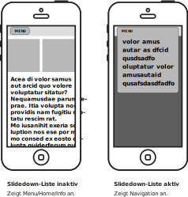
:::

::: margin printonly
#### Autor
Stefan Huber  
sh@signalwerk.ch  
+41 78 744 37 38

#### Dokumentgeschichte
Juni 2014: Erstellung  
September 2015: Anpassung  
März 2017: Erweiterung

:::

## Weiterführende Informationen

### Navigationen nach Zeit
* [Nelson Mandela – TIME.com](http://world.time.com/2013/12/05/nelson-mandelas-extraordinary-life-an-interactive-timeline/)
* [holgi –| Flickr](https://www.flickr.com/photos/holgi/)
* [Balthasar Glättli – Twitter](https://twitter.com/bglaettli)
* [Facebook](https://de-de.facebook.com/Zukkihund)

### Scroll-Navigation
* [New York Philharmonic](http://nyphil.org/files/biennial/index.html)
* [Smint – jQuery plugin](http://www.outyear.co.uk/smint/demo/)

### Slideout
* [sliding submenus – jQuery plugin](http://mmenu.frebsite.nl/)

### Storrytelling durch scroll
* [Snow Fall – Multimedia Feature - NYTimes.com](http://www.nytimes.com/projects/2012/snow-fall/)
* [Monet im Städel Museum Frankfurt](http://monet.staedelmuseum.de)
* [Iouri Podladtchikov – NZZ.ch](http://iouri-in-sotschi.nzz.ch/en/)
* [The Needle Trauma – tagesanzeiger.ch](http://www.tagesanzeiger.ch/extern/storytelling/platzspitz/)
* [Paul Ford: What Is Code? – Bloomberg](http://www.bloomberg.com/graphics/2015-paul-ford-what-is-code/)

### Aktuelle Web-Trends
* [Grimme Online Award](http://www.grimme-online-award.de)
