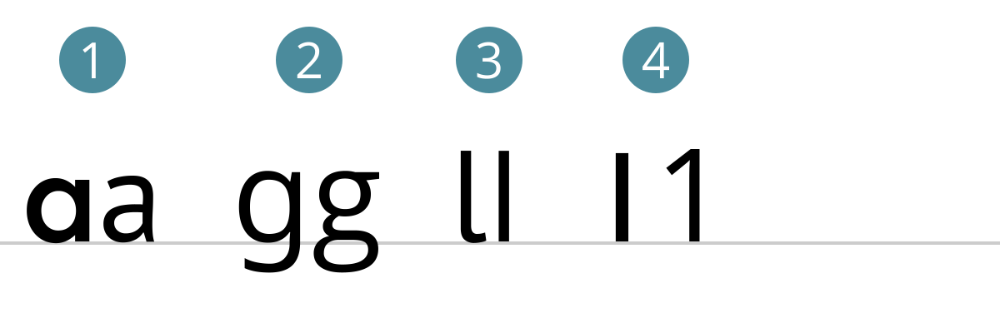

# Fonts · Eigenschaften

::: TOC
**Content**
[[TOC]]
:::

## Vierliniensystem

Die lateinische Schrift basiert auf einem so genannten Vierliniensystem. Alle Schriftzeichen des Alphabet orientieren sich an der Schriftlinie und haben maximal zwei weitere Linien, an denen Sie sich orientieren.
::::: grid fullsize

:::::

::::: grid fullsize
:::: col_6of12 inlinecode
1. Kegelunterkante · CSS: `text-bottom`
2. p-Linie (Decenderline, beardline)
3. Schriftlinie, Grundlinie (Baseline) · CSS: `baseline`
4. x-Linie, Mittellinie (x-line)
5. H-Linie, Versallinie (Cap line)
6. k-Linie (Acenderline)
7. Kegeloberkante · CSS: `text-top`
::::
:::: col_6of12_last ABC
1. x-Höhe, Mittellänge (x-Height)
2. Unterlänge, Unterhöhe (Decender depth)
3. Versalhöhe (Cap height)
4. Oberlänge (Acender height)
5. Überhang (Overshoot)
6. Vertikaler Raumbedarf, Kegelgrösse, Schriftgrösse (Font Size, em)
7. Fleisch (buffer space, shoulder)
::::
:::::

 
 

### CSS
Objekte in HTML können mittels CSS an der Schrift ausgerichtet werden.

  <code>vertical-align: baseline; </code>
  <code>vertical-align: text-top; </code>
  <code>vertical-align: text-bottom; </code>

 
 
 

## Anatomie der Buchstaben

::: margin
1. Anstrich
2. geschlossener Punze
3. offener Punze
4. Ohr, Fähnchen
5. Abstrich
6. Schulter
:::

::: margin
1. Stamm, Grundstrich
2. Haarstrich
3. Serife
4. Anstrich/Dachansatz
5. Halbserife
6. Schleife
7. Achslage
:::

## Spezielle Buchstabenformen

::: margin
1. Einstöckiges a | Zweistöckiges a
2. Zweistöckiges g | Dreistöckiges g
3. Krückstock l (Erik Spiekermann) | normales l
4. Amerikanische 1 | Europäische 1
:::

