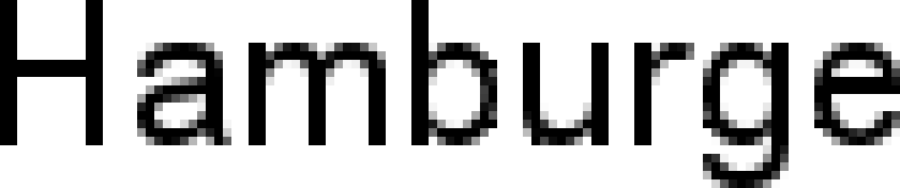
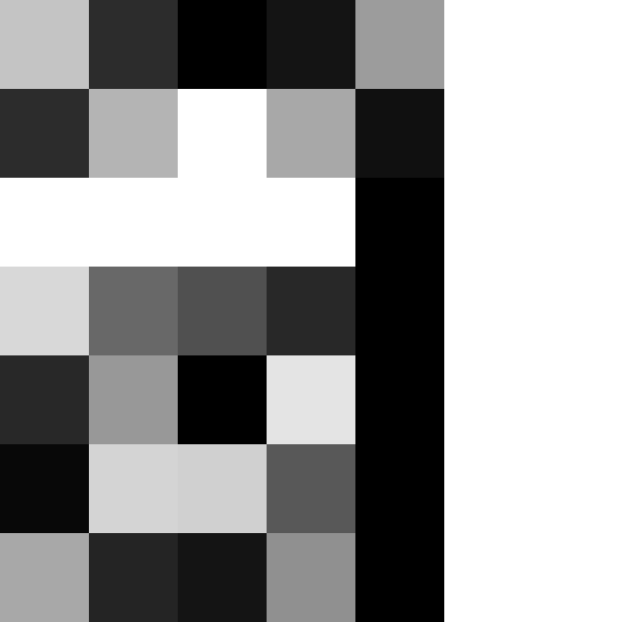

# Technologie · Fontdarstellung

::: TOC
**Content**
[[TOC]]
:::

## Fonts auf Websites
### Geschichte
::: margin compact
#### Browser mit Webfont-Unterstüzung
* Chrome 4.0+
* Internet Explorer 4+
* Firefox 3.5+
* Safari 3.1+
* Opera 10+

Quelle: [Web typography - Wikipedia](https://en.wikipedia.org/wiki/Web_typography)

:::
Seit Computer eine Darstellung an einem Bildschirm aufweisen, wurde immer wieder nach technischen und gestalterischen Möglichkeiten gesucht, Schriften möglichst den Wünschen des Gestalters entsprechend dar zu stellen. Als das World Wide Web 1993 durch das CERN frei gegeben wird, war die Formatierung noch nicht durch einen Gestalter zu beeinflussen. Lediglich der Browser bestimmte das aussehen. Mit der Einführung von CSS im Jahre 1996 wurde dann die Möglichkeit geschaffen, Schriften einem Inhalt zu zuweisen. Allerdings musste der entsprechende Font bereits auf dem Zielgerät installiert sein. Bereits 1997 ermöglichte Microsoft mit damaliger Technologie in Ihrem Browser das Laden von Fonts über das Internet. Somit wurde es möglich, eigene Schriften einzusetzen. Doch diese Technologie war nur auf Internet Explorer (Windows) verfügbar und auch von den Font-Anbietern sehr schlecht akzeptiert. Erst im Jahre 2009 wurde auf Grundlage von OpenType ein neues Format namens «WOFF» (Web Open Font Format) entwickelt. Dieses Format wurde sehr schnell von Browser-Herstellern und von Font-Anbietern akzeptiert, so dass heute Problemlos auf allen wichtigen Browsern der vom Gestalter gewünschte Font dynamisch in die Seite geladen werden kann.

### Web Safe Fonts (Systemfonts)
Unter Systemfonts wird häufig eine Auswahl an Schriften verstanden, die zu einer sehr hohen Wahrscheinlichkeit auf dem Betriebssystem installiert sind, auf dem ein Browser eine Website darstellt. Somit ist der Browser in der Lage diesen Font zu verwenden und es muss kein zusätzlicher Font übertragen werden. Die Auswahl dieser Fonts ist sehr beschränkt und variiert stark von Betriebssystem zu Betriebssystem. Um dennoch die Gestaltung mehr oder weniger unter Kontrolle zu behalten, werden in einem CSS sogenannte Fallbacks angegeben. Das heisst, wenn eine Schrift nicht vorhanden ist, so kommt eine andere zum Einsatz.

#### Beispiel
CSS-Definition mit Font-Fallbacks:

::: code
<pre>
p {
  font-family: Arial, Helvetica, sans-serif;
}
</pre>
:::
Es wird versucht zuerst Arial einzusetzen. Wenn keine Arial vorhanden ist, soll Helvetica zum Einsatz kommen und sonst eine beliebige Serifenlose.

### Verbreitung und Vorteile von Webfonts
Meist kommt bei Webfonts das WOFF (Web Open Font Format) zum Einsatz. Seit 2014 sind auch die besser komprimierten WOFF 2.0 Dateien im Gebrauch, die heute von allen modernen Browsern unterstützt werden. Auch ältere Browser können mit älteren Font-Formaten (EOT)  Schriften einbinden.
Verfügt man über eine Lizenz eines Webfonts, so kann diese Schrift dynamisch zur Seite hinzugeladen werden. Der Gestalter weiss somit, wie seine Seite aussehen wird und kann die Typografie vollständig kontrollieren.

## Darstellung von Fonts

### Vektor zu Pixel
Heutige Fonts bestehen meist aus Vektor-Daten, die dann für die Anzeige an einem Ausgabegerät in eine Pixel-Matrix umgesetzt werden müssen. Diese Umrechnung von Vektoren zu Pixel kann auf verschiedene Arten geschehen. Die dafür zuständige Software wird Renderer genannt und ist je nach Hersteller unterschiedlich und liefert für die selben Vektoren unterschiedliche Ergebnisse.

 
 
 

::::: grid fullsize
:::: col_6of12
::: grid w80p

:::
#### Font als Outline
Microsoft Arial Unicode
::::
:::: col_6of12_last
::: grid w80p

:::
#### 12 Pixel Höhe (PPM) – S/W
Gerendert werden alle Pixel die zu mindestens
50% innerhalb der Kontur liegen (ohne Hinting).
::::
:::::

 
 

### Auflösung
Je höher die Auflösung eines Buchstaben ist, um so klarer nähert sich die Pixel-Darstellung an die Vektorform an.
Eine höhere Auflösung pro Buchstabe kann erreicht werden, indem die Grösse des Buchstabens oder die Auflösung des Ausgabegeräts erhöht wird.

 
 

::: grid fullsize upscale

#### MS-Renderer – S/W 8 bis 48 Pixel Höhe (PPM)
Microsoft Arial Unicode (mit Hinting)
:::

## Darstellung ohne Graustufen

:::: margin
::: grid w70p

:::
### 8 bis 18 Pixel Höhe (PPM)
MS-Renderer – S/W  
Microsoft Arial Unicode
::::
Bei kleinen Schriften oder aber bei gewissen Display-Technologien kann es sinnvoll sein, Schrift nur mit S/W darzustellen.

 
 
 

::: grid upscale

:::
### 8 Pixel Höhe (PPM)
Microsoft Arial Unicode – MS-Renderer – S/W

 
 
 

::: grid upscale

### 24 Pixel Höhe (PPM)
Microsoft Arial Unicode – MS-Renderer – S/W

:::

### Unterschiede im Rendering
Bei der S/W-Darstellung von Schrift sind die Unterschiede zwischen verschiedenen Renderern viel weniger stark erkennbar als bei einer Darstellung mit Graustufen.

 
 
 

::::: grid fullsize
:::: col_4of12
::: w70p

:::
#### FreeType-Renderer – S/W
13 Pixel Höhe (PPM) – Microsoft Arial Unicode
::::
:::: col_4of12
::: w70p

:::
#### MS-Renderer – S/W
13 Pixel Höhe (PPM) – Microsoft Arial Unicode
::::
:::: col_4of12_last
::: w70p

:::
#### Apple-Renderer – S/W
13 Pixel Höhe (PPM) – Microsoft Arial Unicode
::::
:::::

## Hinting
Über spezielle Instruktionen wird die Kontur einer Schrift so verformt, dass die Darstellung besser auf ein Pixel-Grid passt. Danach wird diese neue Kontur vom Renderer gerastert. Die Verformung ist auch so optimiert, dass zum Beispiel die x-Höhe über einen ganzen Font hinweg in allen Zeichen gleich hoch erscheint.

 
 

::::: grid fullsize
:::: col_4of12
### Font als Outline
Microsoft Arial Unicode

::::

:::: col_4of12
::: w80p

:::
::::

:::: col_4of12_last
::: w80p

:::
::::
:::::

 
 
 

::::: grid fullsize
:::: col_4of12
### Hinting – 12 Pixel Höhe (PPM)
Konturen werden optimiert für Rasterung.

::::

:::: col_4of12
::: w80p

:::
::::

:::: col_4of12_last
::: w80p

:::
::::
:::::

## TrueType vs. PostScript
Da der Aufwand einen Font mit guten Hints (Anweisungen) zu versehen sehr gross ist, sind nicht alle Fonts gleich gut optimiert und somit auch in der Qualität der Anzeige extrem verschieden. Häufig werden Schriften, die vorwiedgend für den Druck gezeichnet wurden, lediglich über eine automatische Hinting-Funktion optimiert. Dies führt nicht zu der selben Qualität in der Anzeige, wie wenn die Instruktionen von Hand eingefügt wurden.
PostScript basierte Schriften (OpenType PS & PostScript Type 1) ermöglichen weniger genaues Hintig wie TrueType basierte Schriften (OpenType TT & TrueType).

 
 

### TrueType mit von Hand eingefügten Hints
Microsoft Arial Unicode

::::: grid fullsize

Die Stammstärken des Buchstaben wachsen gleichmässig an.
:::::

 
 
 

### Autohints in PostScript
AMB Newut Medium

::::: grid fullsize

Stammstärken und Schriftlinie wirken nicht durchgehend.
:::::

## Darstellung mit Graustufen
:::: margin
::: grid w70p

:::
### 8 bis 18 Pixel Höhe (PPM)
MS-Renderer – Graustufen  
Microsoft Arial Unicode
::::
Oft wird im Web und bei eBooks eine Darstellung der Schrift mit Schriftglättung gewählt. Die Schrift erscheint weicher aber auch besser lesbar. Charaktereigenschaften in Zeichen können mit Graustufen auch in einem Pixel-Raster mit wenig Auflösung relativ gut erahnt werden.

 
 
 

::: grid upscale

:::
### 8 Pixel Höhe (PPM)
Microsoft Arial Unicode – MS-Renderer – Graustufen

 
 
 

::: grid upscale

### 24 Pixel Höhe (PPM)
Microsoft Arial Unicode – MS-Renderer – Graustufen

:::

### Unterschiede im Rendering
Bei der Darstellung von Zeichen mit Graustufen wird je nach eingesetztem Renderer der Unterschied zwischen den einzelnen Technologien sehr deutlich sichtbar.

 
 
 

::::: grid fullsize
:::: col_4of12
::: w70p

:::
#### FreeType-Renderer – Graustufen
13 Pixel Höhe (PPM) – Microsoft Arial Unicode
::::
:::: col_4of12
::: w70p

:::
#### MS-Renderer – Graustufen
13 Pixel Höhe (PPM) – Microsoft Arial Unicode
::::
:::: col_4of12_last
::: w70p

:::
#### Apple-Renderer – Graustufen
13 Pixel Höhe (PPM) – Microsoft Arial Unicode
::::
:::::

## Darstellung mit Subpixel-Rendering
Bei der Darstellung mit Subpixeln wird die Schrftglättung nicht nur über verschiedene Graustufen erzeugt, sondern auch noch der Vorteil ausgenutzt, dass ein Bildschirm in horizontaler Richtung eine dreifach grössere Auflösung besitzt, da die RGB-Darstellung über drei Farb-Zustände in horizontaler Richtung geschieht. Dadurch wird die Darstellungsqualität wesentlich verbessert.

::::: grid fullsize space3 upscale
:::: col_6of12

Schematische Darstellung ohne Glättung
::: small
Bildquelle: [Subpixel-Rendering – Wikipedia](http://de.wikipedia.org/wiki/Subpixel-Rendering)
:::

::::
:::: col_6of12_last

Schematische Darstellung mit Subpixel-Rendering
::::
:::::

::: margin space3
### Apple-Renderer – S/W
Microsoft Arial Unicode – 12 Pixel Höhe (PPM)
:::

 

::: margin space3
### Apple-Renderer – Subpixel
Microsoft Arial Unicode – 12 Pixel Höhe (PPM)
:::

## Farbige Fonts
Es gibt vier verschiedene Möglichkeiten, wie in einem OpenType-Font farbige Elemente definiert werden können. Abweichende «Standards» wurden jeweils separat von folgenden Parteien entwickelt;

* Microsoft (COLR/CPAL)
* Apple (SBIX)
* Google (CBDT/CBLC)
* Adobe/Mozilla (SVG)

Da es somit technisch kompliziert ist für einen Renderer alle vier Definitionen zu unterstützen, ist die Verbreitung von farbigen Fonts sehr gering. Betriebsysteme bieten üblicherweise einen farbigen Emoji-Font, passend auf das jeweilige Betriebsystem, an. Jedoch gibt es darüber hinau wenige Fonts, die diese Technologie nutzen, da es auch für Schriftgestalter technisch mühsam ist alle Standards zu unterstützen.

### Einfärben
 

Einige Technologien unterstützen auch das Einfärben einzelner Layer oder Teile.

Bildquelle: [Typography.Guru – Color Emoji](https://typography.guru/journal/windows-color-fonts/)
 
 

### Fallback
::::: grid fullsize space2

:::: col_6of12

Farbige Fonts können nur von wenigen Programmen angezeigt werden. Renderer die Farbige Fonts nicht unterstützen zeigen lediglich die S/W-Version an.
::::

:::: col_6of12_last

::::

Ist der Renderer in der Lage die neuen Instruktionen im Font zu lesen, so kann die farbige Version angezeigt werden.
:::::

::: margin printonly
#### Autor
Stefan Huber  
sh@signalwerk.ch  
+41 78 744 37 38

#### Dokumentgeschichte
Mai 2014: Erstellung  
September 2015: Erweiterung  
März 2017: Erweiterung
:::

## Weiterführende Informationen

### Subpixel-Rendering
* [Subpixel-Rendering – Wikipedia](http://de.wikipedia.org/wiki/Subpixel-Rendering)

### Fonts in Webfonts konvertieren
* [Font Squirrel](http://www.fontsquirrel.com/tools/webfont-generator)

### Webfonts und Kompression von Webfonts
* [Web Open Font Format - Wikipedia](https://en.wikipedia.org/wiki/Web_Open_Font_Format)
* [WOFF File Format 1.0](http://www.w3.org/TR/WOFF/)
* [WOFF File Format 2.0](https://www.w3.org/TR/WOFF2/)
* [Google Developers Blog – WOFF 2.0](http://googledevelopers.blogspot.hu/2015/02/smaller-fonts-with-woff-20-and-unicode.html)

### Farbige Fonts
* [Pixelambacht – multicolor fonts](https://pixelambacht.nl/2014/multicolor-fonts/)
* [Color fonts from Adobe Type](https://color.typekit.com/)
* [OpenType-SVG color fonts](https://helpx.adobe.com/typekit/using/ot-svg-color-fonts.html)
* [Colorfont – JavaScript Solution](http://manufacturaindependente.com/colorfont/)
* [Typography.Guru – Color Emoji](http://typography.guru/journal/windows-color-fonts/)
* [OpenType - Wikipedia](https://en.wikipedia.org/wiki/OpenType#Color)
