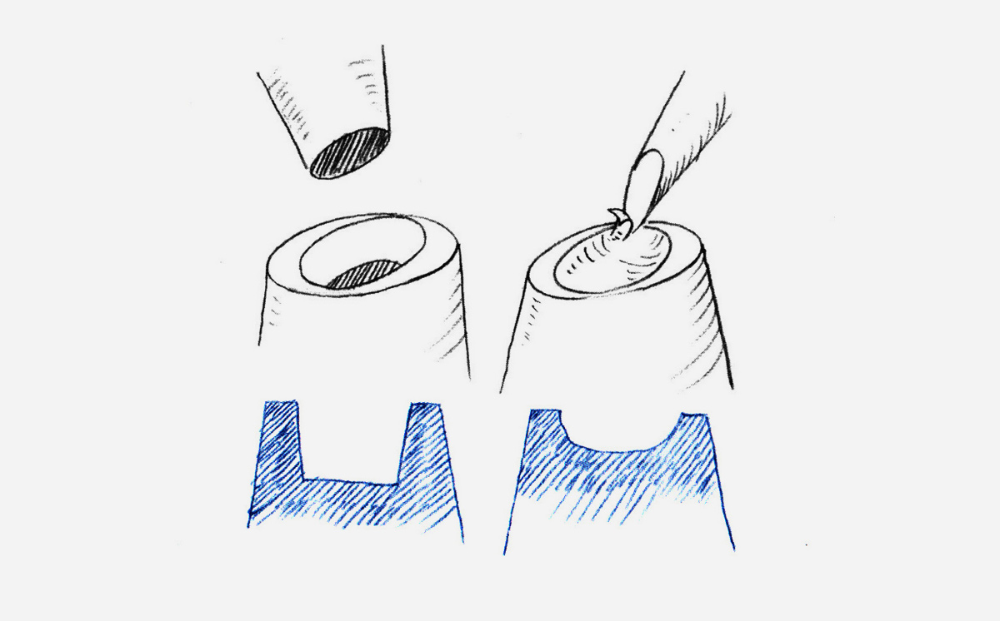
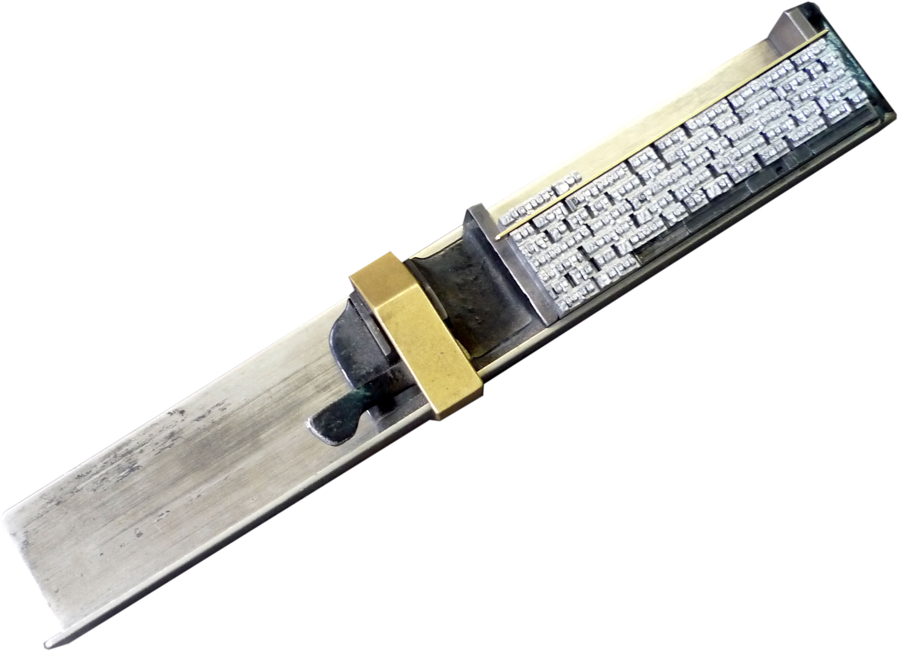
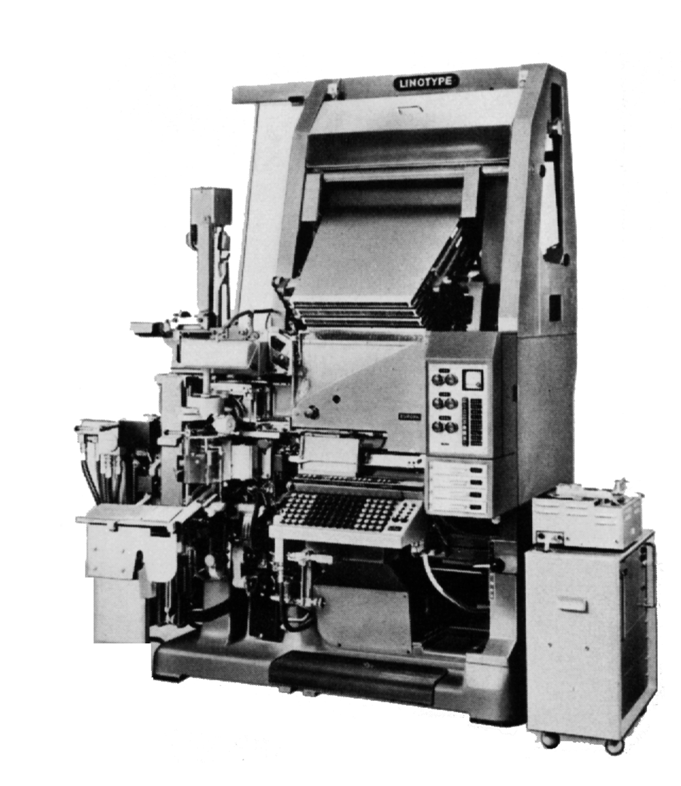
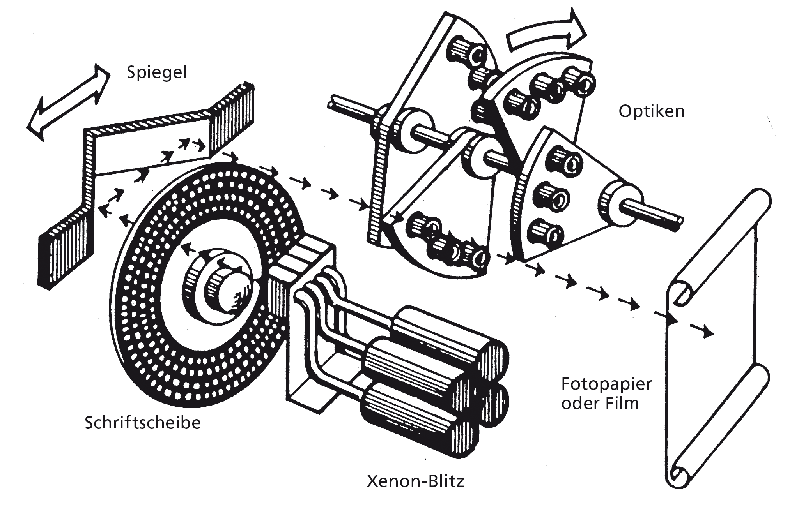
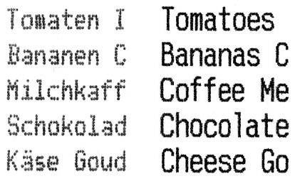
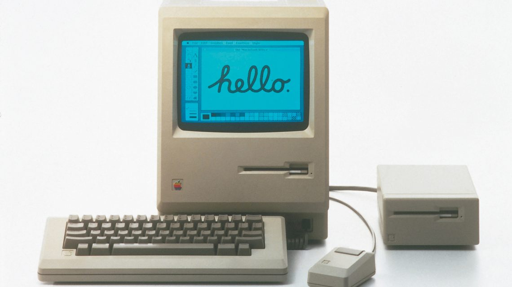
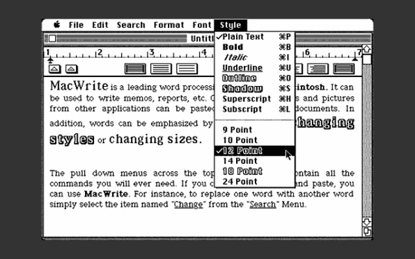

# Technologiegeschichte der Schrift

::: TOC
**Content**
[[TOC]]
:::

## Intro
Die Nachfolgende Dokumentation soll die wichtigsten technologischen Schritte aufzeigen, die sich im 20. und 21. Jahrhunder auf die Schriftform ausgewirkt haben. Die Dokumentation beansprucht keine Vollständigkeit. Die hier dargestellte Technologiegeschichte hat einen Fokus auf die Europäische Geschichte.

[Übersicht über die Geschichte der Schrift](https://www.ardmediathek.de/tv/LexiTV/Geschichte-der-Schrift/MDR-Fernsehen/Video?bcastId=7545188&documentId=20112174)

# Der Buchstabe
Um sich schriftlich auszudrücken, werden Buchstaben benutzt. Zu Wörtern und Sätzen zusammengestellt vermitteln sie eine Aussage, die nicht nur inhaltlich, sondern auch optisch beinfluss- und manipulierbar sind. Die Buchstaben sind die Einzelteile des Alphabets und repräsentieren einen einzelnen Laut (Phonem) der menschlichen Sprache. Die Versalformen (Grossbuchstaben) basieren auf der Römischen Kapitalis (in Stein geschlagene Schrift), das gemeine Alphabet (Kleinbuchstaben) auf der Weiterentwicklung dieser Formen (karolingische Minuskel, humanistische Minuskel). Der Buchstabe als visuelles Zeichen der Sprache hat vorwiegend bei der Darstellung oder Übermittlung von Botschaften eine Bedeutung. Nur in seltenen Fällen, wird auch im gesprochenen Kontext auf Buchstaben zurückgegriffen (Buchstabieren).

## Römische Capitalis Monumentalis
Die Capitalis Monumentalis ist eine der wichtigsten römischen Schriften aus der Antike. Sie wird auch als Lapidarschrift bezeichnet, da sie vorwiegend mit Pinsel auf Stein (lateinisch lapis = Stein) geschrieben wurde und dann die form aus dem Stein gemeisselt. Sie gilt massgebend für die Formgebung der heutigen Grossbuchstaben. Die Capitalis Monumentalis besteht nur aus Grossbuchstaben (Versalschrift) und beinhaltet noch nicht alle heutezutage gebräuchlichen Schriftzeichen.

::: grid fullsize

Römisches Nationalmuseum in den Thermen des Diolektian, Rom
:::

## Karolingische Minuskel
Die karolingische Minuskel wurde zum Ende des 8. Jahrhunderts im Auftrag von Karl dem Grossen als einheitliche Buch- und Schreibschrift entwickelt. Sie gilt als massgebend für die Formgebung der heutigen Kleinbuchstaben.

::: grid fullsize

Karolingische Minuskel, Pergament, im Kloster Reichenau Ende des 10.Jahrhunderts geschrieben worden.
:::

## Handschrift & Buchschrift
Über Jahrhunderte war es üblich Kulturgüter wie Wissen, Technik, Verträge, Gesetze oder Geschichten in eine handschriftliche Form zu überführen um diese dauerhalft zu festigen und unabhängig von Zeit und Ort zu konservieren.  

Wollte man mehrere Kopien eines Buches oder einer Notiz, so beanspruchte jede «Kopie» genau gleich viel Zeit wie das erstellen des «Originals». Bücher wurden somit von Hand in Skriptorien in Klöstern (Schreibstuben) abgeschrieben. Eine Kopie mit meist aufwendigen Ausschmückungen konnte mehrere Jahre Arbeit in Anspruch nehmen. Erst ab ende des Mittelalters gab es auch mehr und mehr kommerzielle Berufsschreiber ausserhalb von Kölstern.

Ab dem 14. Jahrundert verdrängte der Informationsträger Papier aus Hadern (in Europa meist Leinen, Hanf oder Baumwolle) die Pergamente aus Tierhäuten mehr und mehr.

### Werkzeug
Je nach Werkzeug, Achslage und Federdruckent entsteht ein anderes Schriftbild.

::: margin
links: Breitfeder  
rechts: Spitzfeder  
:::

Quelle: «The Stroke» – Gerrit Noordzij

### Achslage
Seit der karolingischen Minuskel hat sich eine kleinschreibung in Kombination zu einer Feder-Lage von etwa 30° breit etabliert. Viele Serifen-Schriften die über die Jahrhunderte entstanden sind orientieren sich an dieser Achslage und der Breitfeder.

::: grid fullsize

:::
Quelle: «Gewone letters: Gerrit Noordzij's early models» – Albert-Jan Pool, 2013

#### Breitfeder

  <iframe src="https://www.youtube.com/embed/i6fWPSMwJT8?start=322&end=345" frameborder="0" allow="autoplay; encrypted-media" allowfullscreen></iframe>

#### Spitzfeder

  <iframe src="https://player.vimeo.com/video/62849657" frameborder="0" webkitallowfullscreen mozallowfullscreen allowfullscreen></iframe>

## Buchdruck

::: margin
Eine rechte Seite aus dem ersten Band der bekannten Bibel, die Gutenberg hergestellt hat (B42 Bd. / Vol. 1 - fol. 102r)
:::

Johannes Gutenberg (Johannes Gensfleisch zur Laden zum Gutenberg) gilt als Erfinder des Buchdrucks mit beweglichen Bleilettern und auch des mechanischen Buchdrucks. Als Goldschmied konnte Gutenberg mit Metall umgehen und erfand ein Handgiessinstrument das es ihm ermöglicht hat, dieselben Buchstaben aus einer Legierung (mit dem Hauptanteil Blei) immer wieder zu giessen. Die so gegossenen Zeichen waren wie kleine erhabene Stempel. Dazu musste die Druckfarbe, die nun auf Bleibuchstaben haften musste, als auch eine abgeänderte Spindelpresse erfunden oder weiterentwickelt werden, um die ersten Druckprodukte mit dieser neuartigen Technik zu produzieren.
Diese Erfindung des Buchdruck (Hochdruckverfahren) verbreitete sich ab ~1450 ausgehend von Mainz (Deutschland) innert weniger Jahre über die ganze Welt und wurde technisch beinahe unverändert bis ins 20. Jahrhundert beibehalten.
~1455 erschien Gutenbergs 42-zeilige Biebel (B42), welches als erstes gedrucktes Buch mit beweglichen Bleilettern gillt. Gutenberg hatte dafür die damals übliche Textura (Schriftart) der Schreibstuben in Bleibuchstaben überführt und mit vielen verschiedenen Ligaturen und Zeichenformen das «künschtliche Schreiben» möglichst ähnlich dem damals vorherschenden Schreibstiel angepasst.

Der Wachsende Bedarf an Bedruckstoffen fürhte dazu, dass prozentual immer weniger Bücher auf Pergament gedruckt wurden. Jedoch galten bis ins 19. Jahrhundert Pergament-Bände als besonders Wertvoll.

::::: grid fullsize
:::: col_6of12
#### Johannes Gutenberg

Johann Gensfleisch zum Gutenberg, Kupferstich nach André Thevet, 1584.
::::
:::: col_6of12_last
#### Bleiletter

::::
:::::

### Schriftherstellung
Für die Herstellung von Bleilettern benötigt man eine Matrize, von der man giessen kann. Diese Matrize wird von einer Patrize – dem so genannten Stempel – geschlagen.

Stempel können geschnitten oder geschlagen werden.  
Quelle: Counterpunch. 2nd ed. Hyphen Press. London, 2011.

#### Stempel schneiden

Quelle: [Wikipedia](https://en.wikipedia.org/wiki/Punchcutting#/media/File:Cutting_a_punch_for_a_Qu_ligature.jpg)

#### Stempel schlagen

Durch die wiederverwendung von Negativ-Stempeln (Counterpunch) kann Zeit gespart werden.  
Quelle: Counterpunch. 2nd ed. Hyphen Press. London, 2011.

#### Matrizen schlagen
::: margin

Quelle: [Dutchtypelibrary](https://www.dutchtypelibrary.nl/index_desktop.html)

:::

Quelle: [Wikipedia](https://en.wikipedia.org/wiki/Punchcutting#/media/File:De_Vinne_1904_-_Punch_and_matrix.jpg)

### Handsatz
Der Handsatz ist das Aneinanderreihen von Bleitypen, welche der Setzer von Hand aus dem Setzkasten in den Winkelhaken stellt und zu Wörtern und Zeilen zusammenfügt. Durch das Aneinanderreihen von Zeile an Zeile entsteht die Textspalte (Kolumne). Gesetzt wird in Spiegelschrift. Alle druckenden Teile sind erhöht. Das nichtdruckende Material wird Blindmaterial genannt.

::: margin
Einzelne Bleibuchstaben werden im Winkelhaken zu Zeilen zusammengestellt.
:::

Quelle: Stefan Huber

### Setzmaschinen
Die Erfindungen des maschinellen Einzelbuchstabensatzes (Monotype ~1890) und des Zeilensatzes (Linotype ~1886) änderten im Grunde das Prinzip des Herstellungsverfahrens nicht, sondern es wurde nur mechanisierten und beschleunigten. Beim Monotypesatz und später auch – etwa ab dem Jahr 1950 – beim lochbandgesteuerten Zeilensatz, fand die Arbeitsteilung Eingang in die Setzereien und brachte dem traditionell handwerklichen Gewerbe einen industriellen Akzent. Fortan war das Setzen von der eigentlichen Satzherstellung getrennt.
Anfangs mechanisch, später auch optisch arbeitende Abtastgeräte steuern die Setzmaschinen.

::::: grid fullsize
:::: col_6of12
#### Monotype

::::
:::: col_6of12_last
#### Linotype

::::
:::::

#### Linotype

  <iframe src="https://www.youtube.com/embed/13trF0_XIMs?start=34" frameborder="0" allow="autoplay; encrypted-media" allowfullscreen></iframe>

 

  <iframe src="https://www.youtube.com/embed/avDuKuBNuCk" frameborder="0" allow="autoplay; encrypted-media" allowfullscreen></iframe>

#### Montoype Keyboard

  <iframe src="https://www.youtube.com/embed/LcphfMlOzk4?start=20" frameborder="0" allow="autoplay; encrypted-media" allowfullscreen></iframe>

 

#### Montoype Caster

  <iframe src="https://www.youtube.com/embed/M9DV95IEKGU?start=690" frameborder="0" allow="autoplay; encrypted-media" allowfullscreen></iframe>

## Fotosatz
Fotosatz lösste ab etwa 1960 (zweite Generation) den Bleisatz langsam ab und ermöglichte mit fotografischen Mitteln eine Produktion von Typografie. Durch den geringeren Materialbedarf und die schnellere Handhabung konnten Kosten gesenkt werden.
Fotosatz ist ein opto-mechanisches System und erfordert ein anderes Druckverfahren (Offsetdruck) als noch Bleisatz.

::: grid fullsize

:::
Arbeitsweise von Fotosatzsystem mit Schriftscheibe. Die Optik steuert dabei die Schriftgrösse.

Adrian Frutiger mit Lumitypescheibe

### Optische Korrekturen
Um trotz einer leichten Unschärfe, beim Belichten der Negativvorlagen auf den Film, möglichst scharfe Ecken zu erhalten durden diese im Schriftentwurf überhöht.

::: margin
Vorlage für Haas Unica mit optischen Korrekturen
:::

Quelle: [Monotype](https://www.monotype.com/resources/articles/new-from-old-the-why-and-how-of-reviving-a-typeface/)

## Rubbelbuchstaben (Lettraset)
Vor allem in Grafik-Studios konnte man sich keine Satzanlagen leisten. Somit wurden – vor allem für Poster und Headlines – Rubbelbuchstaben verwendet. Diese wurden dann später reprografisch für den Offsetdruck aufbereitet.

::::: grid fullsize
:::: col_6of12

Quelle: [CreativePro](https://creativepro.com/scanning-around-gene-when-letraset-was-king/)

::::
:::: col_6of12_last

::::
:::::

## Licht- & Lasersatzsysteme
Die dritte Generation im Fotosatz brachte ab etwa 1965 Belichtungssysteme, die auf Kathodenstrahlröhre oder Laser basierten. Dabei wurde Zeilenweise ein fotografischer Film verwendet belichtet und die Kathodenstralröhre diente als kontrollierte Lichtquelle. Somit konnten auch aus der EDV-Verarbeitung digitale Signale analog ausgegeben werden.

Quelle: [kosamari.com](https://kosamari.com/presentation/bangbangcon-2016/#44)

### Erste WYSIWYG-Systeme
Die ersten Systeme der digitaler Satzherstellung hatten noch keine grafische Ausgabe. Die Satzanweisungen wurden ohne visuelle Kontrolle in den Computer eingegeben. Erst säter wurden so genannte WYSIWYG-Monitore (what you see is what you get) entwickelt, die noch vor der Ausgabe eine visuelle Kontrolle der Typografie ermöglichten.

::::: grid fullsize
:::: col_6of12
#### Digiset-System ohne Monitor

Quelle: [Hell Verein Kiel](http://51666937.de.strato-hosting.eu/Produkte/Digiset/digiset400t1.htm)
::::
:::: col_6of12_last
#### Scantext mit WYSIWYG

Quelle: [Albert-Jan Pool](https://www.flickr.com/photos/albert-jan_pool/sets/72157634061121533)
::::
:::::

### Fonts werden Digital
Die digitalisierung der Schrift erforderte eine Umsetzung der Schriftform in ein fixes gefügtes zweidimensionales Raster. Aus heutiger Sicht könnte man von einem Pixelraster sprechen. Auch wenn damals noch eher in Linien gedacht wurde.

::: margin
Linienbildung bei der Belichtung mit Kathodenstrahlröhre (CRT)
:::

## Nadeldrucker
::: margin
Auch heute können noch Nadeldrucker problemlos gekauft werden.

Quelle: Epson

:::

Nadeldrucker fanden vor allem mit dem Aufkommen von Heimcomputern ab den 1980er Jahren weite Verbreitung. Das Verfahren ist simpel und durch den mechanischen Druck konnten auch Durchschlagpapiere verwendet werden. Für die grafische Branche spielte der Nadeldrucker keine wesentliche Rolle, da die Qualität zu gering war.

Quelle: [Wikipedia](https://de.wikipedia.org/wiki/Nadeldrucker)

### Schriftbild
::: margin

Die Anzahl Nadeln ergibt die Auflösung der Schriftzeichen.
:::

links: Nadeldrucker, rechts: Tintenstrahldrucker  
Quelle: [Digital Media for Artists](http://www.dma.ufg.ac.at/app/link/Hardware%3AAusgabe/module/10161?step=2)

## Ikarus
Im Jahr 1975 wurde von der Firma URW ein System namens Ikarus eingführt damit war es möglich mit einem für den Benutzer relativ einfachen System eine Aussenlinie eines Fonts zu beschreiben. Das System wird bis heute weiter entwickelt und viele hochwertige fonts wurden in den 1980–1990er Jahren mit diesem System gemacht.

[Making Faces: Metal Type in the 21st Century](https://vimeo.com/82013261) Zeitmarke: 12:15

Zeichnung für die DLT Dorian mit den für Ikarus typischen Markierungen die für die digitale Erfassung nötig sind.  
Quelle: [Dutchtypelibrary](https://www.dutchtypelibrary.nl/index_desktop.html)

## Apple und TrueType
::: margin

Quadratische Kurve (TrueType)
Quelle: [Wikipedia](https://en.wikipedia.org/wiki/B%C3%A9zier_curve)
:::

Als Apple den Macintosh 1984 auf den Markt brachte, war eine von vielen Erneuerungen, dass der Benutzern die Wahl zwischen verschiedenen Schriften hatte. Nebst Monospace-Schriften gab es auch proportionale Schriften, was für diese Zeit unüblich war. Die Anzahl Fonts waren jedoch noch stark begrenzt und bis 1991 unterstützte der Macintosh nur Bitmap-Fonts, also aus einzelnen Bildern bestehe Schriften.
Mit der Einführung von MacOS System 7 im Mai 1991 brachte Apple mit dem neu entwickelten TrueType-Schriftformat (Quadratische Funktion) zum ersten mal Vektor-Fonts auf den Massenmarkt. Von nun an konnten Fonts beliebig skalliert werden und die passende Darstellung für den Bildschirm wurde aufgrund der Vektordaten errechnet.
Die TrueType-Technologie wurde später auch an Microsoft lizenziert.

::: margin

Fonts von Susan Kare für Apple Macintosh entwickelt.
:::

MacOS 1 startete bereits mit diversen vorinstallierten Schriften

Mit MacOS 7 gab es die Möglichkeit anstatt Bitmaps Vektoren zu verwenden.

## Adobe und PostScript
::: margin

Kubische Kurve (PostScript)
Quelle: [Wikipedia](https://en.wikipedia.org/wiki/B%C3%A9zier_curve)
:::

Adobe wurde im Dezember 1982 von John Warnock und Charles Geschke gegründet. Zuvor hatten die beiden bei Xerox PARC gearbeitet, hatten dies jedoch verlassen, um die Vektorbeschreibungssprache PostScript (Kubische Funktion) zu entwickeln. 1985 lizenzierte Apple PostScript für den Einsatz in seinen LaserWriter-Druckern nun als Seitenbeschreibungssprache. Diese läuteten eine Revolution für die Grafische Industrie ein, da es nun möglich war für relativ wenig Geld sehr hochwertige Ausgaben zu erzielen.

### Laserdrucker

  <iframe src="https://www.youtube.com/embed/WB0HnXcW8qQ" frameborder="0" allow="autoplay; encrypted-media" allowfullscreen></iframe>

::: margin printonly
#### Autor
Stefan Huber  
sh@signalwerk.ch  
+41 78 744 37 38

#### Dokumentgeschichte
Juni 2018: Erstellung  
:::

## Weiterführende Informationen

### Zusammenfassungen
* [The U.S. Computer Printer Industry](http://jacques-andre.fr/chi/chi90/tomash.html)
* [Digitalgeschichte der Schrift – Technologie](http://www.designhistory.org/Digital_Revolution_pages/EarlyDigType.html)
* [Digitalgeschichte der Schrift – Menschen](http://www.designhistory.org/Digital_Revolution_pages/PioneersDig.html)
* [Graphic Means – Film](http://www.graphicmeans.com/film/)
* [Apple und DTP](https://www.fastcodesign.com/3065804/how-apple-helped-democratize-typography-in-the-90s)

### Technologie
* [Counterpunch](https://typejournal.ru/articles/Counterpunch-Review)
* [Linotype – Film](http://www.linotypefilm.com/)
* [ppm – Pixelformat](https://en.wikipedia.org/wiki/Netpbm_format) ([Spezifikation](http://netpbm.sourceforge.net/doc/ppm.html))
* [IBM Selectric](https://player.vimeo.com/video/139984057)
### Fontformen
* [Kapitalis Monumentalis](https://typejournal.ru/en/articles/The-Trajan-Letter-in-Russia-and-America)
* [Bell Centennial](https://nicksherman.com/articles/bellCentennial.html)

## Weiterführende Stichworte

* Optical Sizes
* Buchproduktion vs. Manuskript
* Ausbreitung von Druckpresen in Europa
* Donald Knuth

 
 
 
 
 
