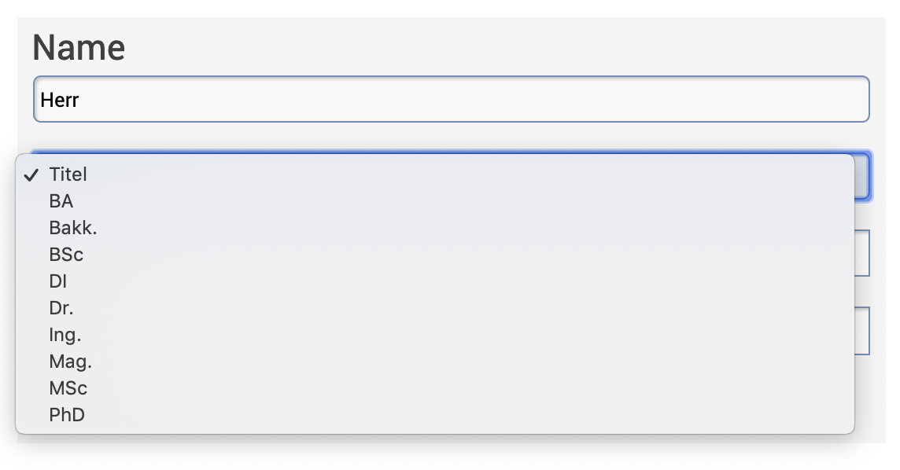
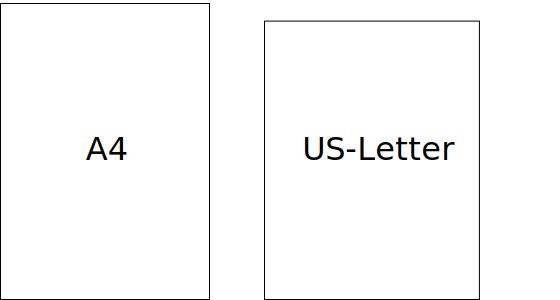
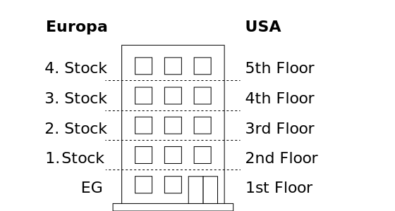

# Lokalisierung · Internationalisierung


## Intro


<style>


.example {
  background-color: #ddd;

  padding-top: 0.7rem;
  padding-right: 1.2rem;
  padding-bottom: 0.9rem;
  padding-left: 1.2rem;

  margin-top: 1rem;
  margin-bottom: .3rem;
}

.example--h1 {
  font-size: 3rem;
}

.example--rtl {
  text-align: right;
}

.example-wm.Text1 span, .example-wm.Text1 {
  writing-mode: horizontal-tb;
  -webkit-writing-mode: horizontal-tb;
  -ms-writing-mode: horizontal-tb;
}

.example-wm.Text2 span, .example-wm.Text2 {
  writing-mode: vertical-lr;
  -webkit-writing-mode: vertical-lr;
  -ms-writing-mode: vertical-lr;
}

.example-wm.Text3 span, .example-wm.Text3 {
  writing-mode: vertical-rl;
  -webkit-writing-mode: vertical-rl;
  -ms-writing-mode: vertical-rl;
}

.example-wm.Text4 span, .example-wm.Text4 {
  writing-mode: sideways-lr;
  -webkit-writing-mode: sideways-lr;
  -ms-writing-mode: sideways-lr;
}

.example-wm.Text5 span, .example-wm.Text5 {
  writing-mode: sideways-rl;
  -webkit-writing-mode: sideways-rl;
  -ms-writing-mode: sideways-rl;
}

</style>

### Lokalisierung (l10n)

::: margin
#### l10n
Lokalisierung wird oft als l10n geschrieben. 10 gibt dabei die Anzahl der Buchstaben zwischen l und n im englischen Wort «localization» ist. Gesprochen wird jedoch von Lokalisierung/localization.

:::

Mit «Lokalisierung» meint man den Vorgang, wie man Content und Produkte an einen Kulturkreis anpasst. Dazu können ganz verschiedene Anpassungen nötig sein.

Beispiele für Anpassungen bei der Lokalisierung:
* Sprache
* Wähnrung
* Kulturelle Referenzen
* Farben
* Zeitangaben

### Internationalisierung (i18n)

::: margin

#### l10n
Internationalisierung wird oft als i18n geschrieben. 18 gibt dabei die Anzahl der Buchstaben zwischen i und n im englischen Wort «internationalization» ist. Gesprochen wird jedoch von Internationalisierung/internationalization.

:::

Bei der «Internationalisierung» geht es darum ein System oder Produkt so zu gestalten, dass später eine Lokalisierung möglich ist.

Einige Beispiele für Internationalisierung
* Dimensionen ermöglichen – Ein System so bauen, dass mehrere Dimensionen – wie Sprache oder Land – möglich wird
* Fallbacks – Was geschieht, wenn ich nicht alle Inhalte in allen Dimensionen habe?
* Templating – Inhalt und Programmcode von einander abspalten. Inhalt sollte unabhängig vom Prgorammcode editiert werden können
* Views – Der selbe Inhalt sollte je nach Kulturkreis anders angezeigt werden. Beispiel Datum.


## Text

### Sprache, Land und Kultur

::: margin
* [Lokalisierungen vom Unicode Konsortium](https://www.unicode.org/cldr/charts/33/summary/root.html)
* [W3C · Internationalization techniques: Authoring HTML & CSS](https://www.w3.org/International/techniques/authoring-html)
:::


Text ist für die Lokalisierung meist in die jeweilige Sprache anzupassen. Jedoch genügt eine reine Sprachliche Anpassung nicht immer. So kann zum Beispiel in mehreren Ländern die selbe Sprache gelten aber andere Währungen. Somit ist eine weitere Dimension zu Pflegen. Auch lokale Referenzen und Vergleiche werden nicht überall gleich verstanden.

In einem Browser kann die Sprache über grundsätzlich drei Faktoren gewählt werden:
* Geolokalisierung aufgrund der IP (ungenau)
* Sprache aufgrund der Browsersprache
* Gemäss Auswahl des Kunden (Voreinstellung oder Sprachwahl)


::: margin
#### Dimensionen
Beispiel einer Website um Flüge zu buchen. Es gibt drei Dimensionen der Lokalisierung:

* Region
* Sprache
* Währung
:::


::: margin
#### Individualisierung
Beispiel zur Konfiguration des MacOS 10.14 Betriebsystem

:::


## Unicode


::: margin

### Vorläufer
* Diverse Standards für verschiedene Betriebsysteme und Sprachregionen
* [ASCII](http://ascii-table.com/) diente für die ersten 127 Zeichen des späteren Unicode

### Unicode Version 1 <br />(Oktober 1991)
7161 Zeichen für insgesammt 24 Schriftsysteme wurden standardisiert.

### Unicode Version 12 <br />(März 2019)
137 993 Zeichen für insgesammt 150 Schriftsysteme wurden standardisiert.


:::

Das [Unicode Konsortium](http://www.unicode.org/) wurde geschaffen um eine Standardisierung zu erreichen, welcher Wert/Zeichencode (Codepoint) welchem Schriftzeichen (Glyph) entspricht.


### Beispiel

* Wert 65 entspricht einem lateinischen A (Grossbuchstabe)
* Notation meist in Hex `U+0041`
* In HTML in DEC `&#65;` oder HEX `&#x41;` geschrieben.
* [Unicode Eintrag für A](http://unicode.org/cldr/utility/character.jsp?a=0041)


### Encoding

Beim Encoding wird festgehalten, wie der Codepoint abgespeichert wird.

### Verbreitete Encodings für Unicode
* [UTF-8](https://en.wikipedia.org/wiki/UTF-8)
* UTF-16 (nur verwenden, wenn UTF-8 nicht möglich)
* UTF-32 (nur verwenden, wenn UTF-8 nicht möglich)

### Beispiel
* A = BIN `01000001` in UTF-8 Encoding


### Falsches Encoding
<div class="example example--h1">
Wörter → Wˆrter

</div>
Encoding «Windows Latin 1» als «Mac OS Roman» interpretiert.


::: margin
### Noto
Der [Google-Font Noto](https://www.google.com/get/noto/) hat das Ziel alle Zeichen des Unicode-Standards in einem Font zugänglich zu machen. Der Name des Fonts sthet für für «No Tofu». Wobei Tofu hier den «replacement character» □ meint.
:::

<div class="example example--h1">
W□rter – W�rter
</div>


Wenn das Zeichen korrekt Encoded ist, jedoch der Font kein Glyph für das Zeichen hat, so werden so genannte «replacement characters» gezeigt.


## Übersetzungen
Übersetzungen werden meist gebraucht um eine verschriftliche Sprache in eine andere zu überführen. Dies kann heute durch Menschen oder durch Maschinen gemacht werden. Maschinelle übersetzungen sollten nur dort gebraucht werden, wo es keine Möglichkeit gibt einen Menschen mit dieser Aufgabe zu betrauen, da maschinelle Übersetzungen noch immer Fehlerhaft sind.

## Schreibweise
Je nach Region können sich einzelne Wörter oder Schreibweisen durchgesezt haben. Dies ist bei einer Lokalisierung zwinden zu berücksichtigen. Nachfolgend einige Beispiele.


### ß oder ss

::: margin
* Infos zur Unicode [Normalisierung](http://unicode.org/reports/tr15/) von  ß = ss
:::


<div class="example example--h1">
Grösse: 80 m
</div>
Eine Schreibweise ohne «ß» wird in der Schweiz als normal erachtet. In Deutschland wird dies als Schreibfehler wahrgenommen.

<div class="example example--h1">
Größe: 80 m
</div>
Eine Schreibweise mit «ß» wird in Deutschland aber auch in der Schweiz als normal erachtet.

### US oder UK
<div class="example example--h1">
color gray
</div>
Die US-Schreibweise wird häufig auch ausserhalb von den USA in internationalen Medien verwendet.


<div class="example example--h1">
colour grey
</div>
Die UK-Schreibweise wird häufig in UK aber zum Teil auch im akademischen Umfeld benutzt.


## Vergleiche & Bezüge
Vergleiche sind sehr individuell für eine Kulturform und können nicht global verstanden werden. Sie unterscheiden Sich sogar innerhalb einer Kulturform zum gleich Massiv.

### Grössenvergleiche
Oft in populären Medien wird zum Veranschaulichen eine nicht [SI-Norm](https://de.wikipedia.org/wiki/Internationales_Einheitensystem) verwendet.

::: margin compact

#### Saarland
In Medien aus Deutschland oft mit der «Flächeneinheit» Saarland ein Vergleich gemacht. Im Nachbarland Schweiz ist hingengen nicht einmal allen Menschen  klar, dass Saarland ein Bundesland in Deutschland ist und sie haben kein Gefühl für dessen grösse.

:::

<div class="example example--h1">
«… ist etwa doppelt so groß wie das Saarland.»
</div>
~ 2570 km²


### Vorwissen

Je nach Publikum und Alter haben die Konsumenten eine andere Vorbildung und gewisse Bezüge funktionieren nicht mehr.

::: margin compact
#### Geschichte
Meist sind geschichtliche Referenzen nur dann zu verstehen, wenn Sie sehr bekannt sind oder in der eigenen Lebenszeit erlebt wurden.
:::
<div class="example example--h1">
«Noch während der chinesischen Kulturrevolution …»
</div>
~ 1966 – 1976

<div class="example example--h1">
«Noch während dem 2. Weltkrieg …»
</div>
~ 1939 – 1945


## Typografie

::: margin
* [Typographizer](https://github.com/frankrausch/Typographizer) korrigiert Anführungszeichen.
:::

Die typografischen Regeln ändern sich von Land zu Land. Ein Beispiel sind Anführungs- und Schlusszeichen. Aber auch sonstige Regeln können in verschiedenen Ländern anders interpretiert werden.


### Schweiz
In der Schweiz werden die Anführungszeichen mit den so genannten Guillemets geschrieben:

<div class="example example--h1">
«Hallo Welt!»
</div>

Kommen innerhalb der Anführungszeichen weitere Anführungen vor, so kommen die einfachen Anführungszeichen zur Anwendung:

<div class="example example--h1">
«Ich lese die Site ‹Typo-Nerd› täglich.»
</div>

### Deutschland

<div class="example example--h1">
„Hallo Welt!“  
</div>

<div class="example example--h1">
„Ich lese die Site ‚Typo-Nerd‘ täglich.“
</div>


### Französisch

<div class="example example--h1">
« Bonjour ! »  
</div>

<div class="example example--h1">
Jean a dit : « C'est la ‹ morale du film › »
</div>

### Englisch
In der englischen Sprache kommen die «Double quotes» zum Einsatz.

<div class="example example--h1">
“The best is yet to come.”
</div>

oder aber auch die «Single quotes»


<div class="example example--h1">
‘The best is yet to come.’
</div>

### Laufrichtung des Textes

::: margin

### Beispiel
* [Twitter · Laufrichtung links nach rechts](https://twitter.com/sfgzzh?lang=de)
* [Twitter · Laufrichtung rechts nach links](https://twitter.com/sfgzzh?lang=ar)

:::


Je nach Sprache kann der Text in ganz verschiedene richtungen laufen. In den westlichen Sprachen wird häufig von links nach rechts gelesen. Entsprechend der Leserichtung ist auch die Abfolge der Elemente zu sortieren.

### left to right (ltr) und right to left (rtl)
Häufig wird von ltr oder rtl Sprachen gesprochen. Diese Abkürzungen stehen für die Anfangsbuchstaben des englischen «left to right» und «right to left».

<div class="example example--h1 example--rtl">
עברית
</div>
Hebräisch ist eine häufig verwendete rtl Sprache (Wortbedeutung: Hebräisch)


### vertikale Laufrichtungen
In heutigen Browsern lassen sich auch vertikale Laufrichtungen realisieren. Jedoch unterstützt nicht jeder Browser jeden Modus.

::: margin
Beispiel von [MDN](https://developer.mozilla.org/en-US/docs/Web/CSS/writing-mode)
:::


<table>
  <tr>
    <th>CSS-Wert</th>
    <th>Vertikales Schriftystem</th>
    <th>Horizontales Schriftystem</th>
    <th>Gemischte Schriftysteme</th>
  </tr>
  <tr>
    <td>horizontal-tb</td>
    <td class="example-wm Text1"><span>我家没有电脑。</span></td>
    <td class="example-wm Text1"><span>Example text</span></td>
    <td class="example-wm Text1"><span>1994年に至っては</span></td>
  </tr>
  <tr>
    <td>vertical-lr</td>
    <td class="example-wm Text2"><span>我家没有电脑。</span></td>
    <td class="example-wm Text2"><span>Example text</span></td>
    <td class="example-wm Text2"><span>1994年に至っては</span></td>
  </tr>
  <tr>
    <td>vertical-rl</td>
    <td class="example-wm Text3"><span>我家没有电脑。</span></td>
    <td class="example-wm Text3"><span>Example text</span></td>
    <td class="example-wm Text3"><span>1994年に至っては</span></td>
  </tr>
  <tr>
    <td>sideways-lr</td>
    <td class="example-wm Text4"><span>我家没有电脑。</span></td>
    <td class="example-wm Text4"><span>Example text</span></td>
    <td class="example-wm Text4"><span>1994年に至っては</span></td>
  </tr>
  <tr>
    <td>sideways-rl</td>
    <td class="example-wm Text5"><span>我家没有电脑。</span></td>
    <td class="example-wm Text5"><span>Example text</span></td>
    <td class="example-wm Text5"><span>1994年に至っては</span></td>
  </tr>
</table>


## Sortierung
::: margin
* [Unicode Sortierung](https://www.unicode.org/reports/tr10/tr10-38.html)
:::

Für die Sortierung von Einträgen gibt es in ganz verschiedenen Kulturkreisen verschiedene Regeln. Sortierungen müssen von technischen Systemen unterstütz werden, da diese meist Automatisch gemacht werden.

### Deutscher Sprachraum
::: margin
Beispiele aus [Wikipedia](https://de.wikipedia.org/wiki/Alphabetische_Sortierung#Beispiel_f%C3%BCr_deutschsprachige_Sortierungen)
:::
Im deutschen Sprachraum alleine gibt es bereits drei Sortierungen.

* DIN 5007 Variante 1 = Lexikon
* DIN 5007 Variante 2 = Telefonbuch
* Österreichische Sortierung (Telefonbuch)


::::: grid fullsize

:::: col_4of12
<div class="example example--h1">

### DIN 5007 Variante 1
* Göbel
* Goethe
* Goldmann
* Göthe
* Götz

</div>

**ö = o**
::::

:::: col_4of12
<div class="example example--h1">

### DIN 5007 Variante 2
* Göbel
* Goethe
* Göthe
* Götz
* Goldmann

</div>

**ö = oe**
::::

:::: col_4of12_last
<div class="example example--h1">

### Österreichische Sortierung
* Goethe
* Goldmann
* Göbel
* Göthe
* Götz

</div>

**ö folgt auf o**
::::

:::::


## Personennamen & Titel

In vielen westlichen Ländern werden akademische Grade oder Auszeichnungen – wie zum Beispiel Doktor oder Hofrat (in Östereich gebräuchlich für höhere Beamte) – im Namen geführt. Da gewise Personen einen Wert darauf legen, sollte dies jeweils berücksichtigt werden.  
In Österreich gibt es zum Beispiel [über 1500](https://karriere.sn.at/karriere-ratgeber/fort-weiterbildung/wo-der-titel-regiert-28942096) Titel die per Gesetz geregelt sind.




Beispiel der [Wiener Staatsoper](https://www.wiener-staatsoper.at/)


## Masseinheiten

Ausser Myanmar, Liberia und die USA haben alle anderen Länder das [internationale Einheitensystem (SI)](https://de.wikipedia.org/wiki/Internationales_Einheitensystem). Da jedoch die USA im internationealen Umfeld eine wichtige Rolle spielt und diverse Internet-Dienste US-basiert sind, gilt es einige Besonderheiten im Zusammenhang mit den US-Einheiten zu beachten.

### Längen
::: margin compact
#### US Längenmass
* 1 Punkt (DTP) = ~0.3527 mm
* 72 Punkt (DTP) = 1 Zoll
* 1 Zoll = 2.54 cm
* 1 Fuss = 12 Zoll = 30.48 cm
* 1 Meile = 63 360 Zoll = ~1.61 km
:::
In den USA werden kleinere Längen in Zoll (2.54 cm) oder Fuss (30.48 cm) angegeben. Grössere Distanzen werden in Meilen (~1.61 km) gemessen. Dies führt dazu, dass Amerikaner in der täglichen Konversation eine kleinere Auflösung von Längeneinheiten angeben. Beispiel: Viele Menschen in Europa kennen ihre Körpergrösse auf 1 cm genau. Viele Amerikaner nur auf ½ Fuss genau oder maximal einen Zoll.

### Papiergrössen
Beim Ausdrucken im US-Raum muss davon ausgegangen werden, dass die Ausgabe auf dem Format US-Letter erfolgt und nicht im sonst üblichen A4.
::: margin compact
#### US-Letter
* 8.5 × 11 Zoll =  215.9 × 279.4 mm

#### A4
* 210 × 297 mm
:::


## Temperatur
In den meisten Regionen der Welt wird Grad Celsius (°C) zur Temperaturangabe benutzt in den USA wird Grad Fahrenheit (°F) verwendet. Eine entsprechende Umrechnung muss für die jeweilige Lokalisierung gemacht werden.

## Zeit
In vielen Kulturregionen der Welt wird ein Tag (eine Rotation um die Erdachse) in 24 Stunden eingeteilt. Die Stunden wiederum in 60 Minuten. Andere weit weniger verbreitete und beinahe unbekannte Systeme sind [dezimale Systeme](https://en.wikipedia.org/wiki/Decimal_time) wie zum Beispiel die [Swatch Internet Time](https://en.wikipedia.org/wiki/Swatch_Internet_Time).

### 24-Stunden oder AM/PM
In einigen Regionen der Welt wird anstatt der 24-Stunden-Schreibweise für die Zeit ein 12-Stunden-Schreibweise mit AM (ante meridies, vor Mittags) und PM (post meridies, nach Mittags) als Zusatz geschrieben. Dies führ vor allem bei Mitternacht und Mittags oftmals zu verwirrung;

| AM/PM | [ISO 8601](https://en.wikipedia.org/wiki/ISO_8601) |
|-------|-----|
| 11:59 AM | 11:59 |
| 12:00 PM | 12:00 |
| 11:59 PM | 23:59 |
| 12:00 AM | 24:00 |

Wir die AM/PM schreibweise verwendet, sollten keine führenden Nullstellen bei der Stunde verwendet werden um [Verwirrungen](https://twitter.com/LeaVerou/status/1229481014906511360) zu vermeiden. Also nicht ~~02:45 PM~~ sondern 2:45 PM. Aber immer führende Nullstellen bei den Minuten.


### Schaltsekunde
Da die Erde leicht langsamer um die eigene Achse rotiert, als die definierte Anzahl Sekunden (86400) in einem Tag (Sekunde zu schnell definiert), wird mit «Schaltsekunden» diese Abweichung kompensiert.

Der «Internationale Dienst für Erdrotation und Referenzsysteme» legt fest, wann eine zusätzliche Schaltsekunde eingefügt werden muss. Dies ist in unregelmässigen abständen und an unterschiedlichen Daten (meist 30. Juni oder 31. Dezember) der Fall.

#### Beispiel
```md
31.12.2011 23:59:59
31.12.2011 23:59:60 ← Schaltsekunde
01.01.2012 00:00:00
```
<br>

Es gibt diverse Probleme mit Computer-Systemen und Schaltsekunden. [Einige Firmen](https://aws.amazon.com/blogs/aws/look-before-you-leap-december-31-2016-leap-second-on-aws/) sind dazu übergegangen, die Schaltsekunde über einen Tag zu verteilen um keine einundsechzigste Sekunde in einer Stunde haben zu müssen.


### Zeitzonen
Durch die Erdrotation werden verschiedene Regionen der Welt zu unterschiedlichen Zeiten der Sonne zugewandt (Tag). Die Zeitmessung wird jedoch meist daran gerichtet, dass man um Mittag den höchsten Sonnenstand möchte. Somit muss die Abweichung über so genannte Zeitzonen kompensiert werden:


Quelle: [Wikipedia](https://en.wikipedia.org/wiki/File:World_Time_Zones_Map.png)

Einige Regionen und politische Einheiten sind trotz grosser Ausdehnung in den Längengraden als einheitliche Zeitzone zusammengefasst. So ist zum Beispiel ganz China in der gleichen Zeitzone (UTC+8). Dadurch ergibt sich beim Grenzüberschritt nach Afganistan der grösste «Zeitsprung» der Erde von -3.5 Stunden.

Es kann vorkommen, dass Zeitzonen «unlogisch» und schnell ändern. Beispiel hierfür ist Australien, welches im Jahr 2000 für die dauer der Olymischen Sommerspiele und im Jahr 2006 für die «Commonwealth Games» ihre Zeitzonen vereinheitlichte.


### UTC – Coordinated Universal Time
Seit 1884 wird der [Nullmeridian](https://de.wikipedia.org/wiki/Nullmeridian) basierend auf der Ortschaft Greenwich (England) verwendet um die Zeitmessung international standardisiert zu koordinieren. Seit 1972 wird dabei von der Koordinierten Weltzeit (UTC – Coordinated Universal Time) gesprochen. Davor wurde der bis heute in England gebäruchliche Ausdruck Greenwich Mean Time (GMT) verwendet.

::: margin compact
Quelle: [Wikipedia](https://de.wikipedia.org/wiki/Nullmeridian)
:::


### CET – Central European Time
Die mitteleuropäische Zeit (MEZ) oder Central European Time (CET) ist die am meisten gebrauchte Zeitzone in Europa. Sie weist zur UTC-Zeit eine Offset von plus einer Stunde auf. Deshalb kann sie auch als UTC+1 geschrieben werden (siehe Sommerzeit).


::: margin compact
Quelle: [Wikipedia](https://de.wikipedia.org/wiki/Mitteleurop%C3%A4ische_Zeit)
:::

Regionen mit mitteleuropäische Zeit (MEZ) in rot markiert.

### Zeitzonen der USA
Die USA hat [insgesammt 11 Zeitzonen](https://de.wikipedia.org/wiki/Zeitzonen_in_den_Vereinigten_Staaten). Wobei meist nur von den vier Zeitzonen auf dem zusammenhängenden Festlandgebiet gesprochen wird:

* Eastern Time Zone – UTC−05:00
* Central Time Zone – UTC−06:00
* Mountain Time Zone – UTC−07:00
* Pacific Time Zone – UTC−08:00


Quelle: [Wikipedia](https://en.wikipedia.org/wiki/File:US-Timezones-post-2007.png)

### Computer & Zeitzonen
Auf vielen Servern wird bei der Installation keine automatische Zeitzone gestellt. Somit haben viele Server UTC als Standard. Bei Desktop-Computern wird meist mit Geolokation versucht die richtige Zeitzone zu finden.


### Sommerzeit
In einigen Regionen der Welt wird in den Sommermonaten eine Sommerzeit (Daylight saving time – DST) eingeführt. Diese wird meist eine Stunde vor der üblichen Zeit gestellt. So ist die mitteleuropäische Zeit (MEZ) in den Wintermonaten UTC+1 und in den Sommermonaten UTC+2.

::: margin compact
#### Schweiz
Am 28. Mai 1978 wurde in einer Volksabstimmung (Referendum) beschlossen, dass man sich nicht mit der Sommerzeit den Nachbarstaaten anschliesst. Aufgrund massiver Probleme wurde die «Zeitinsel-Schweiz» per Gesetz ab 1. Januar 1981 dem Ausland angeglichen und das Chaos hatte ein Ende.  
Quelle: [Wikipedia](https://en.wikipedia.org/wiki/Daylight_saving_time)
:::

Regionen mit Sommerzeit in blau markiert. Bildquelle: [Wikipedia](https://en.wikipedia.org/wiki/Daylight_saving_time)


Politische Entscheide können sehr schnell die Einführung oder Abschaffung von Sommerzeit beeinflussen. [In Maroko](https://www.maghreb-post.de/gesellschaft/marokko-regierung-schafft-die-zeitumstellung-ab/) wurde zum Beispiel am 27. Oktober 2018 beschlossen, dass die Winterzeit am Folgetag nicht mehr zur Anwendung kommen wird. Dies führte zu diversen Problemen, da die Umstellung sehr kurzfristig war.

#### Abschaffung in der EU
Das EU-Parlament entschied im März 2019, dass nur noch bis 2021 eine Sommerzeitumstellung erfolgen soll. Danach steht es den Mitgliedstaaten frei ob sie in Normal- oder Sommerzeit ihre weiter fahren. Es bleibt zu hoffen, dass die Staaten sich einigen können, so dass es weiterhin eine grosse geschlossene Zeitzone (MEZ) in der EU gibt.

## Datum & Kalender
Der [gregorianische Kalender](https://de.wikipedia.org/wiki/Gregorianischer_Kalender) ist weltweit der meist gebrauchte Kalender und wurde im Jahr 1582 von Papst Gregor XIII verordnet. Dabei hat das Jahr (Umlauf der Erde um die Sonne) im Durchschnitt etwa 365,25 Tage und diese werden auf 12 Monate verteilt. Die Schaltjahre haben 366 Tage, sonstige Jahre werden mit 365 Tagen geführt.

### Regeln für Schaltjahre
* 1\. Regel: Jahreszahl durch vier ganzzahlig teilbaren = Schaltjahr
* 2\. Regel: Jahreszahl durch 100 ganzzahlig teilbaren = kein Schaltjahr (1. Regel überlegen)
* 3\. Regel: Jahreszahl durch 400 ganzzahlig teilbaren = Schaltjahr (2. Regel überlegen)

### Jahr-2000-Problem
Im Jahr 2000 gab es zwei Probleme; Das kleinere Problem war, dass diverse Software das Schaltjahr im Jahr 2000 nicht korrekt berechnet hatten und fälschlich keine Schaltjahr annahmen. Das grössere Problem war, dass teils Jahreszahlen nur zweistellig abgespeichert wurden. Also anstatt zum Beispiel 1999 wurde nur 99 abgespeichert. Beim Jahreswechsel wurde somit neu 00 abgespeichert, was anstatt 2000 als 1900 interpretiert wurde.

## Numerische Notation von Daten
Bei der numerischen Schreibweise für ein Datum gibt es diverse Standards. Es muss die jeweilige Konvention passend zur Anwendung und zum Land berücksichtigt werden.

| Standard | Format                     | Beispiel               |
|----------|----------------------------|------------------------|
| USA      | MM/DD/YYYY                 | 03/29/2000             |
| ISO 8601 | YYYY-MM-DD                 | 2000-03-29             |
| DIN 5008 | YYYY-MM-DD oder DD.MM.YYYY | 2000-03-29 / 29.3.2000 |

## Unix-Timestamp
In Computer-Systemen wird häufig eine Zeit als «Unix time» gespeichert. Dabei handelt es sich um eine Ganzzahl (signed integer) welche die vergangenen Sekunden seit 1. Januar 1970 um 0:00 Uhr räpresentiert. Die Zahl kann ein Vorzeichen haben, also auch einen Minus-Bereich abdecken und somit Ereignisse vor 1970 repräsentieren.

### Beispiele
* 31. Dezember 1999, 23:59:59 = 946 684 799 000
* 22. November 1963, 18:30:00 = –192 778 200

### Jahr-2038-Problem
Im Januar 2038 wird die Sekundenzahl so gross werden, dass die Zahl nicht mehr mit 32 Bit (vorzeichenbehaftete 32-Bit-Ganzzahl) gespeichert werden kann. Einige Computer-Systeme speichern jedoch noch immer in 32 Bit ab. Diese Systeme müssen bis spätestens dahin umgestellt werden. Neuere Systeme speichern Timestamps als 62-Bit-Wert ab. Somit kann noch für die nächsten paar Milliarden Jahre die Zahl problemlos abgespeichert werden.

::: margin compact
Quelle: [Wikipedia](https://de.wikipedia.org/wiki/Jahr-2038-Problem)
:::


## Zahlungsverkehr


## Besteuerung
Viele Länder haben eine Steuer auf verkaufte Güter/Dienstleistung. Grundsätzlich kann davon ausgegangen werden, dass die Steuer im Land des Konsumenten/Käufers erhoben werden muss.

## Mehrwertsteuer in der Schweiz (MwSt)
In der Schweiz gibt es drei Mehrwertsteuersätze. Je nach Produkt/Dienstleistung muss man einen der Sätze versteuern oder ist befreit von der Mehrwertsteuer. Bei Online-Shops gelten die selben Regeln wie an physischen Verkaufsstellen. Es ist empfehlenswert die Gesamtsumme inklusive Mehrwertsteuer anzugeben und dann je Mehrwertsteuer-Satz diese separat auszuweisen.

### Beispiel


## Bankverkehr
Heute wird im internationalen Bankverkehr häufig elektronisch Geld übermittelt. Dabei werdne häufig die Konten mittels IBAN (International Bank Account Number) angegeben. In Deutschland zum Beispiel ist die IBAN als ein Geheimnis zu wahren, da mittels IBAN Geld von einem Konto angefordert werden kann. Somit sollte diese Information nicht unbedingt öffentlich gemacht werden.

## Checks
In den USA werden Banküberweisungen eher selten gemacht. Man schickt seinem Geschäftspartner einen Check, der dann berechtigt vom eigenen Konto den Betrag des Checks zu beziehen.

## PayPal
PayPal ist eines der am weitesten verbreiteten rein elektronischen Zahlungsmittel. PayPal ist relativ einfach in Shop-Systeme zu integrieren und auch Personen ohne PayPal-Konto können dann direkt via Kreditkarte bezahlen.

## Kreditkarten
Um im eigenen Shop mit Kreditkarten zu bezahlen wird meist ein Kreditkarten-Prozessor eingesetzt. Diese Firmen haben Verträge mit den Kreditkartenbetreibern und wickeln den eigentlichen Zahlungsvorgang ab. Als Website-Betreiber kann ich zwischen diversen Betreibern wählen. Hier ein paar grosse Vertreter:

* [Saferpay/SIX](https://www.six-payment-services.com/en/site/e-commerce/solutions/paymentsolution.html) (im Schweizer Markt)
* [datatrans](https://www.datatrans.ch/)
* [Stripe](https://stripe.com/ch)
* [shopify](https://www.shopify.de/zahlungsportal/schweiz)

Es fallen im allgemeinen Gebüren an, die der Shop-Betreiber zu bezahlen hat.

## Twint
In der Schweiz gibt es einen breiten Bankenzusammenschluss für das elektronische Zahlungsmittel «Twint». Dieses kann relativ einfach in bestehende Shops integriert werden. Die Bezahlung erfolgt mittels einem QR-Code, der über die App am Smartphone gescannt und bestätigt werden kann.

## Apple-Pay & Google Pay
Neuere Smartphones habe in Hardware die Funktion einer Kreditkarte abgebildet. Somit können diese an vielen Bezahlstellen, wo auch kontaktlose Bezahlung möglich ist, verwendet werden.


## Geografie

### Kartenprojektion
::: margin
#### Swiss Grid
Die Schweizerische Landesvermessung verwendet für die Projektion der Schweiz üblicherweise die Projektonsart [«Swiss Grid»](https://www.swisstopo.admin.ch/de/wissen-fakten/geodaesie-vermessung/bezugsysteme/kartenprojektionen.html).

* [Visualisierung «Swiss Grid vs. Web Mercator»](https://observablehq.com/@rzoller/swiss-grid-vs-web-mercator)
* [Weitere alternative Projektionen von Karten](http://richarddmorey.org/map/)
:::
Die am weitesten Verbreitete Projektion der runden Erde auf eine zweidimensionale Karte ist die so genannte [Mercator-Projektion](https://de.wikipedia.org/wiki/Mercator-Projektion):


Quelle: [Wikipedia](https://de.wikipedia.org/wiki/Mercator-Projektion#/media/File:Mercator-proj.png)

Zu beachten ist jedoch, dass die Darstellung eine Verzerrung der Grössenverhältnisse ist. Hier die grössenverhältnisse je Land korrigiert:


Quelle: [Wikipedia](https://en.wikipedia.org/wiki/Mercator_projection#/media/File:Worlds_animate.gif)

Es gibt jedoch noch viele ander [Kartenprojektionen](https://en.wikipedia.org/wiki/List_of_map_projections), welche das [Problem](https://xkcd.com/977/) einer Abwicklung einer Kugel versuchen möglichst gut zu lösen.

## Postadressen
Bei Postanschriften ist die jeweilige lokale Schreibweise zu verwenden.

### Beispiel für England
```md
Name
159 Brick Lane
London E1 6SB
```
### Beispiel für USA

```md
Name
3605 N Damen Ave, Rear
60618 Chicago, IL
```

### Stockwerke
Je nach Land werden die Stockwerke anders Nummeriert. Insbesondere in [Nordamerika](https://en.wikipedia.org/wiki/Storey) werden die Stockwerke anders gezählt als in Europa.



### Strassenlogik & Navigation
Gewisse Städte weisen eine Logik der Strasennamen auf oder der Häusernummerierung auf. Dadurch ist es in gewissen Städten für einheimische sehr einfach möglich mit Anzahl Strassen/Blocks zu navigierene. Auch ist in gewissen Städten den einheimischen die Himmelsrichtung sehr bewusst. In Zürich wissen die meisten Leute zum Beispiel nicht in welche Richtung Süden ist. In London oder Chicago jedoch sehr wohl.

<style>
.map-responsive{
    overflow:hidden;
    padding-bottom:56.25%;
    position:relative;
    height:0;
}
.map-responsive iframe{
    left:0;
    top:0;
    height:100%;
    width:100%;
    position:absolute;
}
</style>


### Beispiel New York (Manhattan)
In Manhattan werden (teilweise) Strassen (West – Ost) und Avenues (Nord – Süd) unterschieden und diese nummeriert.

<div class="map-responsive">
    <iframe src="https://www.google.com/maps/embed?pb=!1m18!1m12!1m3!1d6043.751152669622!2d-73.95981316386695!3d40.76476126977315!2m3!1f0!2f0!3f0!3m2!1i1024!2i768!4f13.1!3m3!1m2!1s0x89c2588f046ee661%3A0xa0b3281fcecc08c!2sManhattan%2C+New+York%2C+NY%2C+USA!5e0!3m2!1sen!2sch!4v1553908088407!5m2!1sen!2sch" frameborder="0" style="border:0" allowfullscreen></iframe>
</div>

### Beispiel Washington
In Washington werden Nummern (Nord – Süd) und Buchstaben (West – Ost) für Strassen vergeben.
<div class="map-responsive">
  <iframe src="https://www.google.com/maps/embed?pb=!1m18!1m12!1m3!1d3105.088055169129!2d-77.02333333422055!3d38.89910164126649!2m3!1f0!2f0!3f0!3m2!1i1024!2i768!4f13.1!3m3!1m2!1s0x89b7c6de5af6e45b%3A0xc2524522d4885d2a!2sWashington%2C+DC%2C+USA!5e0!3m2!1sen!2sch!4v1553907503329!5m2!1sen!2sch" frameborder="0" style="border:0" allowfullscreen></iframe>
</div>

## Telefonnummer
::: margin
[Online-Helfer](https://signalwerk.github.io/contact-parser/)
:::
Telefonnummern sollten gemäss der Empfehlung von [ITU-T Recommendation E.123](https://www.itu.int/rec/T-REC-E.123-200102-I/en) formatiert werden.

### Beispiele
```
Schweiz: +41¦78¦700¦10¦10
Deutschland: +49¦341¦2000000
```
¦ = Geschützte schmales Leerzeichen für typografisch korrekte Darstellung


::: margin printonly
#### Autor
Stefan Huber  
sh@signalwerk.ch  
+41 78 744 37 38

#### Dokumentgeschichte
März 2019: Erstellung  
:::


<br />
<br />
<br />
<br />
<br />
<br />
<br />
<br />
<br />
<br />
<br />
<br />
<br />
<br />
<br />
<br />


<div><!––
Textlänge
satzbreite
### Typografie
#### Wortlängen
### Beispiele
––></div>
