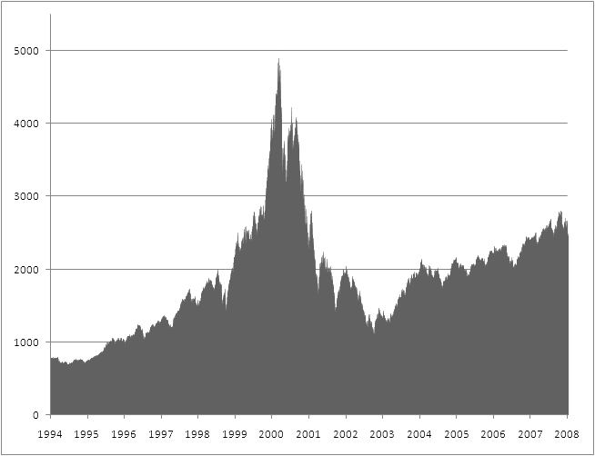

# Technologie · Grundlagen

::: TOC
**Content**
[[TOC]]
:::

## Geschichte des Internets
::: margin

#### Tim Berners-Lee
Gilt als der Erfinder des World Wide Webs und hat am CERN in Genf die erste Website erstellt.
:::
Ab den frühen 1960er Jahren wurden für Grossrechner Konzepte und Techniken entworfen, die Kommunikation über eine abgeschlossene Recheneinheit hinweg ermöglichen. So wurde zuerst in militärischen Forshungsprojekten die Machbarkeit erprobt und später über akademische Forschungsförderung durch den Staat weiter unterstützt.
Durch die politische Situation (Kalter Krieg) angefeuert wurden Konzepte angedacht, die auch bei Störungen im Netzwerk (z. B. Nukleareangriffe) nicht zu einem Totalausfall führen und die bis anhin zentralen und fehlerintolerante Systeme wichen einer dezentrale Struktur, die sich je nach Netzzustand selber regulieren kann.  
Das ARPAnet (Advanced Research Projects Agency Network) wurde vom US-Verteidigungsministerium in Auftrag gegeben und vernetzte 1969 die ersten Rechner an vier verschiedenen Universitäten in den USA. Bereits 1973 waren es 35 Hosts und im Jahr 1982 wurde auf das bis heute eingesetzte und wesentlich robusteres und flexiebleres Kommunikationsprotokoll TCP/IP (Transmission Control Protocol/Internet Protocol) umgestellt, was gleichzeitig auch den Namen «Internet» endgültig zementierte. Als im Jahr 1992 das Internet auch für kommerzielle Unternehmen und somit auch Endkunden freigegeben wurde, ging die Anzahl von am Netzwerk angeschlossenen Computer stetig nach oben.

### Dotcom-Blase und Soziale Netzwerke
::: margin

#### NASDAQ  (Technologie-Kurs USA)
Grosse Investitionen bis 2000 gefolgt von einem «Platzen der Blase».
<!-- Quelle: en.wikipedia.org -->
Quelle: [Nasdaq2 – Wikipedia](http://en.wikipedia.org/wiki/File:Nasdaq2.png)
:::
Durch die stetige technische Verbesserung und dem vermehrten Zugang von Privatpersonen (Kunden)  zum Internet wurden viele Internet-Startups gegründet und ein Diversifikation der zur verfügung stehenden Inhalte und Dienstleistungen wurde stark voran getrieben. Das Internet wurde schnell auch von Investoren als Wachstumsmarkt erkannt und sowohl die Infrastruktur (Internetzugang, Computer, ...) wie auch darauf aufsetztende Dienste (Mailanbieter, Online Shops) wurden stark gefördert und mit Geld unterstütz. So wurde zwischen 1995 und 2000 ein wichtiger Grundstein für das zur verfügung stehende Angebot gelegt. Als im Frühjahr 2000 sich die Investoren schlagartig aus diesen Investitionen verabschiedeten (Dotcom-Blase) platzte vorerst auch die Idee, dass auf dem neu erschlossenen (virtuellen) Marktplatz unersättliche Gewinne warten würden. Die Branche, welche in den boomenden Jahren viel aufbauen konnte rutschte in eine Kriese. Ab mitte der 2000er Jahre wurde über neue Ideen und Konzepte der Vernetzung von Informationen und Personen über Facebook, Twitter und Ähnlichen ein weiterer Anreiz geschaffen das Internet näher in den Altag ein zu bauen. Mit dem Aufkommen von mobilen Endgeräten, die über Internetzugang verfügten, wurde ab etwa 2007 (iPhone)  das Internet mehr und mehr ein stetiger Begleiter des Alltags.

## Struktur des Internet
::: margin
#### IP-Adressen
Jeder Host (Computer im Netz) erhält eine eigene IP-Adresse. Damit wird der Computer eindeutig ansprechbar.
:::
Das Netzwerk über das die Computer zum «Internet» verbunden sind, funktioniert auch heute grösstenteils dezentral.
Sowohl Endkunden des Internets, wie auch Services (Server) erhalten von einem Internet service provider (ISP) eine Leitung zum globalen Netzverbund. Zudem erhält jeder Benutzer gleichzeitig eine eindeutige Adresse (IP-Address), womit das angeschlossene Gerät im Netzwerk wieder zu finden ist. Über verschiedene Zwischenstationen kann nun der eine Computer Daten an eine andere Addresse senden. Dazwischen gibt es viele Möglichkeiten zur Verbindung und es wird für jedes Datenpaket einzeln eine Rute durch dieses Netzwerk gewählt um die im Moment best mögliche Verbindung zu wählen.

Der ISP (Internet service provider) entscheidet dann je nach seinen Kapazitäten, ob er mit einem Nachbar oder anderen Server sich direkt verbinden möchte (Kabel verlegen), um somit seinen Kunden eine möglichst gute Verbindung in das andere Netz zu gewährleisten. Dadurch entstehen allmählich zwischen nahen Knoten oder zwischen hoch frequentierten Knoten mehr Verbindungen und die Kapazität des gesamten Netzwerks wächst.

 
 

::: grid fullsize space3

:::

## Dienste
Das «Internet» ist nur die Infrastruktur für Datenübertragung. Der Benutzer kann mit dem Internet mit hilfe von Anwendungen erst einen Nutzen erlangen, wenn auf dem Internet so genannte Dienste verfügbar sind. Solche Dienste sind zum Beispiel; Mail, WWW, DNS, FTP

### Diensteanbieter (Server)
Ein Server bietet mit einem zuvor definierten Protokoll eine Dienstleistung oder einen Service an, der dem Benutzer eine gewisse Funktionalität ermöglicht. Um diese Dienstleistung zu erhalten muss die Gegenstelle über einen entsprechenden Client Verfügen.

### Dienstenutzer (Client)
Um einen Dienst eines Servers zu nutzen, muss der Client das verwendete Protokoll verstehen können und sich mit dem Server über die Kommunikation einig sein. Kommt diese Übereinkunft zustande, so kann der Nutzer den Server als Dienstleister via Client benutzen.

### URL
::: margin
#### Bestandteile einer URL
| Teil    | Bedeutung                 |
|---------|---------------------------|
| http:// | Angabe über das Protokoll |
| www     | Subdomain                 |
| switch  | Domain                    |
| ch      | Top-Level Domain          |
| index   | Dateiname                 |
| html    | Dateiendung               |

#### Anzeigen einer Website
Ein Benutzer möchte die Website [switch.ch](http://www.switch.ch/index.html) betrachten. Dafür sind nebenstehende Schritte notwendig.
:::
Viele Dienste im Internet sind über sogenannte URL (uniform resource locator) erreichbar. Diese URL enthalten angaben über das verwendete Protokoll, wie auch über die angefrage Resource (z.B. Datei).

 

### Registrar und DNS
Jede Top-Level-Domain (Domain-Adresse) wird von einem so genannten Registrar an einen Halter vermietet. Die Miete ist im allgemeinen pro Jahr zu entrichten und der Anspruch auf die Domain verfällt bei nicht verlängertem Vertrag und kann an den nächsten Halter übergeben werden. Je nach Registrar können verschiedene Top-Level-Domains mit unterschiedlichen Endungen gebucht werden.
Möchte man die Domain gezielt an einen neuen Halter überführen, so kann dies meist mit einem Transfer-Code ausgelöst werden. Je nach Registrar kann dies technisch unterschiedlich funktionieren.

## Registrare in der Schweiz
::: margin
#### Switch ist nicht mehr zuständig
Seit dem 1. Januar 2015 darf SWITCH keine .ch-Domain-Namen mehr direkt an die Kundinnen und Kunden verkaufen. Diese Aufgabe wurde – gemäss der neuen, per 2015 in Kraft getretenen Verordnung über die Internet-Domains – den Registraren übertragen.
:::
Bis zum Jahr 2014 wurden alle .ch-Domains in der Schweiz von switch.ch registrier. Dieses Monopol ist nicht mehr aktiv und es gibt diverse Registrare, die berechtigt sind direkt ihren Kunden Domains mit der .ch-Endung zu verkaufen. Der übliche Preis liegt zwischen Fr. 10 und 20.– pro Jahr.
Es gibt in der Schweiz eine neue .swiss Endung. Zu beachten ist gemäss BAKOM: «Gesuchsteller für einen .swiss Domain-Namen müssen eine ausreichende Verbindung zur Schweiz darlegen.»

## DNS
Um von der Domain (für Menschen) auf eine IP-Adresse (für Computer) zu kommen braucht es DNS (Domain Name System).
Technisch werden bei einer DNS–Abfrage (DNS lookup) im Hintergrund mehrere Aktionen ausgeführt, die sind für den Benutzer des DNS jedoch transparent.

 

::: grid fullsize space3

:::

::: margin printonly
#### Autor
Stefan Huber  
sh@signalwerk.ch  
+41 78 744 37 38

#### Dokumentgeschichte
Mai 2014: Erstellung  
August 2015: Erweiterung  
Februar 2017: Erweiterung  

:::

## Weiterführende Informationen

### Erste Website
* [The World Wide Web project](http://info.cern.ch/hypertext/WWW/TheProject.html)

### Domain-Namen mit .ch-Endung registrieren
* [Hostpoint](http://hostpoint.ch)
* [switchplus ag](http://www.switchplus.ch)
* [Green](http://green.ch)
* ...

### Infos zu Domain-Namen mit .swiss-Endung
* [dot.swiss](http://www.dot.swiss/)

### Domain-Namen mit diversen Endung registrieren
* [Host Europe](https://www.hosteurope.ch/)
* [GoDaddy](https://www.godaddy.com/)
* ...

### Mögliche Top-Level-Domains
* [iana.org](http://data.iana.org/TLD/tlds-alpha-by-domain.txt)

### IP-Adresse einer Domain finden
* [wikiHow](http://www.wikihow.com/Ping-on-Mac-OS)

### Halterinformationen zu einer Domain finden
* [Whois.org](https://www.whois.net/)

### Bedeutung und Wachstum von Technologien
* [Growth of the Internet](http://www.dtc.umn.edu/~odlyzko/doc/oft.internet.growth.pdf)
* [Unnatural Monopoly: Critical Moments in the Development of the Bell System Monopoly](http://object.cato.org/sites/cato.org/files/serials/files/cato-journal/1994/11/cj14n2-6.pdf)
* [ICT Facts and Figures 2016](http://www.itu.int/en/ITU-D/Statistics/Pages/facts/)
* [100-Year of Technology – Graph](https://www.theatlantic.com/technology/archive/2012/04/the-100-year-march-of-technology-in-1-graph/255573/)
* [You Are What You Spend - The New York Times](http://www.nytimes.com/2008/02/10/opinion/10cox.html)
