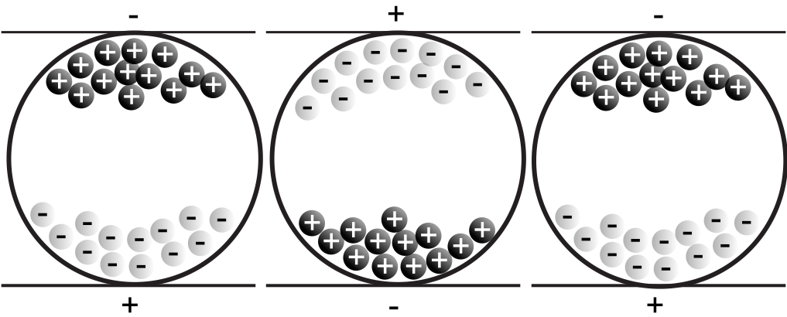
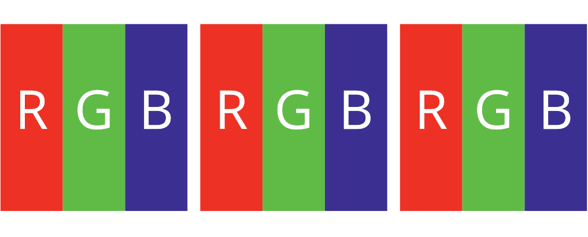

# Screens
<div class='header'></div>


### Bildschirmauflösung
Je nach Auflösung des Bildschirms können mehr oder weniger Pixel auf der Ausgabefläche ausgegeben werden. Je mehr Pixel zur Verfügung stehen, desto grösser kann das Browser-Fenster aufgezogen werden. Bei Websites mit «fixem Layout» werden somit mehr oder weniger Inhalte sichtbar.


::::: grid fullsize space3

:::: col_4of12
::: w60p

:::
::::

:::: col_8of12_last
::: w90p

:::
::::

:::::

:::: grid fullsize space3
::: col_4of12
Bildschrim hat eine zu gerine Auflösung und kann Seite nicht vollständig anzeigen. Ungenügende technische Realisation für mobiles Gerät. Lässt sich vermeiden.
:::

::: col_8of12_last
Bildschrim hat eine grosse Auflösung und kann Seite vollständig anzeigen.
:::
::::


#### Standards
Es gibt diverse Grössen und Standards für Bildschirme und deren Auflösungen. Die Produktevielfallt (Desktop und Mobile) ist so gross, dass wir von keinem Standard mehr ausgehen können. Vielmehr muss man sich gedanken machen, wieviele Geräte man bei einer bestimmten Design-Minimalgrösse noch erreicht. Dabei helfen aktuelle [Satistiken](http://gs.statcounter.com/screen-resolution-stats).

::: grid fullsize

Einige Desktop-Grössen und deren Namen
:::


### Bildschirmabmessung
Die Bildschirmabmessung wird häufig auch in Zoll (Inch) angegeben. Spricht man von Zoll, so meint man im allgemeinen die Diagonale des Bildschirms. Die Grösse gibt meist eher eine Bildschirm-Grössenklasse an, denn eine effektive Grösse. Ein «15"-Bildschirm» hat also meist etwa 15 Zoll in der Diagonale. Die Bildschirmproportion ist dadur aber zum Beispiel nicht definiert.


### Visuelle Grösse
Die visuelle wahrgenommene Grösse eines Gestaltugnselements auf dem Bildschirm, ist abhängig von der effektiven Grösse auf dem Bildschirm und dem Betrachtungsabstand. Obwohl kleine Screens (Smartphones) weniger Platz bieten, so ist der Betrachtungsabstand auch kleiner und es können somit auch ähnliche Lesbarkeiten erreicht werden.


Bildquelle: [Size Calculator](https://sizecalc.com/)


### Auflösungsdichte – DPI

::: margin
#### Rechnungsbeispiel
Ein Tablet kann 3000 Pixel in der Breite anzeigen und hat eine Breite von 25,4 cm. Somit beträgt die Auflösung 300 dpi (in der Breite).

3000 Pixel ÷ 10 Inch (25,4 cm) = 300 Dots per Inch
:::
Eine Auflösungsdichte wird in DPI (Dots per Inch) angegeben. Diese Einheit gibt an, wie viele Bildpunkte pro Inch (25,4 mm = 1 Inch) – also eine Strecke – liegen. Je höher die Auflösung ist, desto weniger erkennt man die einzelnen Punkte in der Ausgabe und die Ausgabe wirkt weniger «verpixelt». Die Auflösung eines Bildschirms kann in DPI angegeben werden.


::: video space3
<iframe src="https://player.vimeo.com/video/169809377" frameborder="0"></iframe>
:::


### DPI Wert ermitteln
Höhe oder Breite des Bildes in Pixel ÷ Höhe oder Breite in Ausgabe (in Inch) = Auflösung in DPI (Dots per Inch)

### Auflösung im CSS
Mit einer Media-Query lassen sich abhängig von Auflösung verschiedene definitionen ein- und ausschalten.

#### Beipiel für Media-Query mit minimaler DPI-Anzahl:


::: margin
1 Zoll (Inch) = 25.4 mm  
1 dpi ≈ 0.39 dpcm  
1 dpcm = 2.54 dpi  
:::

::: code
```css
@media
only screen and ( min-resolution: 190dpi),
only screen and ( min-resolution: 75dpcm)
{
  /* Definitionen hier */
}
```
:::
[Support-Matrix für Browser](https://caniuse.com/#feat=css-media-resolution)

## Pixel zu Dots/Point (Device Pixel Ratio)
So genannte hochauflösende Bildschirme (High pixel density display) zeichnen einen Pixel (Ausmass) mit mehreren Bildschirmpunkten (Dots/Point) an. Ist jedoch pro Pixel mehr Information vorhanden (zum Beispiel bei Bildern), werden die effektiven Bildschirmpunkten mit voller Auflösung genutzt. Je höher die Auflösung eines Bildschrims ist, desto schärfer wirkt der Bildschirm für den Menschen.
Apple spricht bei hochaufgelösten Bildschirmen von Retina-Auflösung.

[The Ultimate Guide To iPhone Resolutions](https://www.paintcodeapp.com/news/ultimate-guide-to-iphone-resolutions)


### Beispiel für Media-Query mit minimaler pixel density
::: code
```css
@media
only screen and ( min-device-pixel-ratio: 2),
only screen and ( min-resolution: 2dppx)
{
  /* Definitionen hier */
}
```
:::
[Support-Matrix für Browser](https://caniuse.com/#feat=css-media-resolution)


## Display Technologien
Grundsätzlich können wir bei modernen Displays zwischen zwei Technologien unterscheiden. Bei klassischen Displays am Smartphone, Desktop oder bei Farb-Tablets werden meist Monitore mit der Technologie TFT LCD (Thin-film-transistor liquid-crystal display) verwendet. Dabei handelt es sich pro Pixel um in den drei Lichtfarben (Rot, Grün, Blau) leuchtende Elemente. Durch additive Farbmischung können Farben erzeugt werden.
Bei elektrophoretischen Anzeigen (eInk) oder ähnlichen Technologien, werden kleine Kugeln oder deren Inhalt so polarisiert, dass es eine schwarze und eine weisse Seite gibt. Daraus können dann mit ganz vielen dieser Kugeln ein S/W-Bild erzeugt werden. Die Kugeln selber sind nicht leuchtend und müssen durch Licht in der Aufsicht (Sonne) oder Hinterleuchtung sichtbar gemacht werden.


:::: grid fullsize space3
::: col_6of12
### Elektrophoretische Anzeige
Kugeln enthalten weisse und schwarze Stellen
Bild-Quelle: [Wikipedia](http://de.wikipedia.org/wiki/Elektronisches_Papier)



#### Geräte mit eInk
eBook-Reader


:::

::: col_6of12_last
### LCD-Anzeige
Drei kleine leuchtende Elemente erzeugen je Pixel eine Ausgabe (Farbe)



#### Geräte mit LCD
Smartphone, Tablet, Desktop


:::
::::


#### OLED
::: margin
[Weitere Informationen](http://www.lg.com/global/business/information-display/technology-solution/oled)

:::

Seit wenigen Jahren sind OLED (organic light emitting diode) eine weitere Display-Technologie, die vermehrt Einsatz findet. Vor allem kleinere Screens, wie in Smartphones verbaut, halten vermehrt mit dieser neuen Technologie einzug. Während beim TFT LCD das Licht über eine weisse Hingergrundbeleuchtung kommt und gefiltert wird, wird beim OLED farbiges Licht ausgestrahlt.

<video controls>
  <source src="https://cdn.rawgit.com/signalwerk/IAD.LAB.DOC/35af6c67/pages/screens/img/REC016.mp4" />
  <source src="https://cdn.rawgit.com/signalwerk/IAD.LAB.DOC/35af6c67/pages/screens/img/REC016.webm" />
</video>
iOS 11 San Francisco Pro Text Regular 17pt auf iPhone X (Foto)

Quelle: Stefan Huber


::: grid fullsize


Bildquelle: [LG](http://www.lg.com/global/business/information-display/technology-solution/oled)
:::


Bildquelle: [Gamezone/LG](https://www.mweb.co.za/games/NewsArticles/tabid/2561/Article/30977/Samsung-QLED-How-does-its-display-work-and-is-it-better-than-OLED.aspx)

OLED Varriante, bei dem zusätzlich zu RGB auch noch eine Weisskomponente angesteuert wird ([WRGB OLED](https://www.youtube.com/watch?v=3qRhTKOu9Pw)).


## Bildwiederholrate
::: margin
* Animation flüssig: ab [20 – 30 Frames pro Sekunde (fps)](https://en.wikipedia.org/wiki/Frame_rate#/media/File:Animhorse.gif)
* Ideal: 60 Frames pro Sekunde
* Wow: einige Geräte haben heute 120 fps

:::
Damit eine Animation flüssig auf dem Bildschirm erscheint, sollten zwischen 20 – 30 Frames pro Sekunde (fps) neu gezeichnet werden. 60 Frames pro Sekunde sind ideal. Viele Monitore können 60 Frames pro Sekunde anzeigen. Die limitierende Komponente ist meist eher ob der Computer in der Lage ist, so schnell die Bilder zu berechnen.


<div class='header'></div>

::: margin printonly
#### Autor
Stefan Huber  
sh@signalwerk.ch  
+41 78 744 37 38

#### Dokumentgeschichte
Juni 2018: Erstellung  
:::


## Weiterführende Informationen


### Kennzahlen zu Bildschirmen
* [Lichtstärke – Lumen](https://de.wikipedia.org/wiki/Lumen_(Einheit))
* [Leuchtdichte – Nits](https://de.wikipedia.org/wiki/Leuchtdichte)
* [Farbraum](https://de.wikipedia.org/wiki/Farbraum)


### Übliche Bildschirmauflösungen
* [Browser Market](http://gs.statcounter.com/)
* [Browser Display Statistics](http://www.w3schools.com/browsers/browsers_display.asp)

### Screens
* [Kathodenstrahlröhre (Cathode ray tube – CRT)](https://youtu.be/3BJU2drrtCM?t=2m17s) & [Wikipedia](https://de.wikipedia.org/wiki/Kathodenstrahlr%C3%B6hre)
* [iPhone X Display](https://www.theverge.com/2017/10/31/16579748/apple-iphone-x-review)
* [Framerate](https://www.youtube.com/watch?v=mjYjFEp9Yx0)
