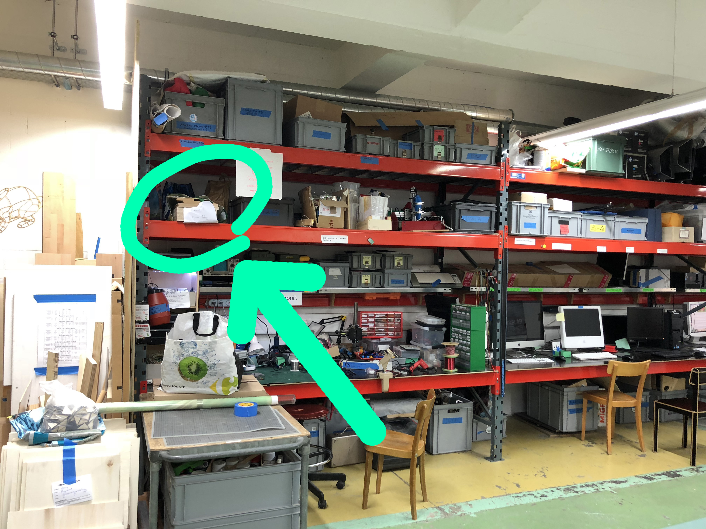
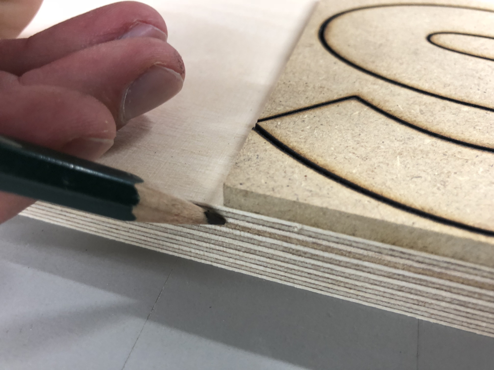
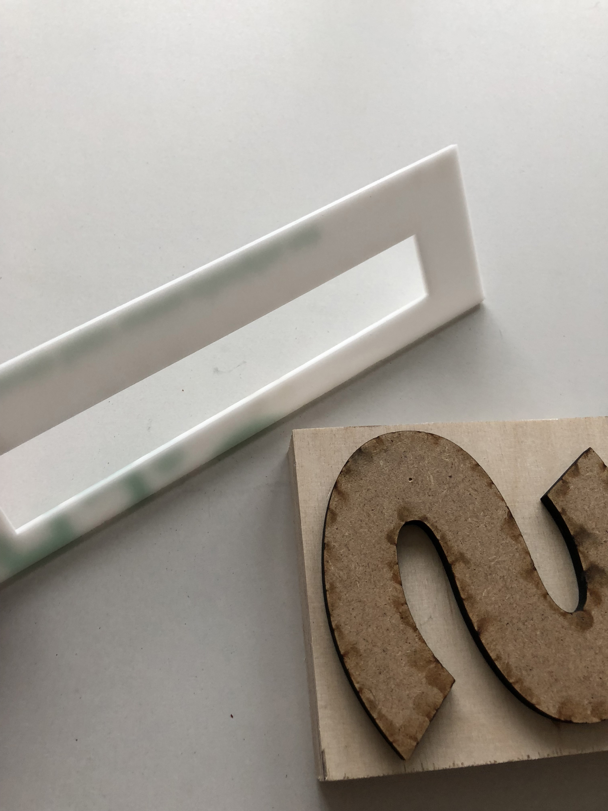

# Info · Fablab

# ACHTUNG!!!
## Wir produzieren wie ein Stempel. Damit nach dem Drucken alles richtig ist, muss der «Stempel» spiegelverkehrt sein!!!

## Pro Person
* 1 Buchstaben gross
* 3 Buchstaben klein

## Material

### Buchstaben klein (~24 Cicero)
* 7 × 18 mm × 550 mm × 108 mm – Sperrholz Birke
* 7 × 5 mm × 550 mm × 108 mm – MDF
* 1 × 18 mm × 450 mm × 108 mm – Sperrholz Birke
* 1 × 5 mm × 450 mm × 108 mm – MDF

### Buchstaben gross (~32 Cicero)
* 5 × 18 mm × 550 mm × 144 mm – Sperrholz Birke
* 5 × 5 mm × 550 mm × 144 mm – MDF

### Sonstiges
* 2 × Holzleim
* 2 × Lehre um Schrifthöhe zu prüfen (siehe unten)
* 2 × Schleifpapier

## Anleitung

### Datei (mit Stefan Huber)
* Dateien als .ai-Files auf das richtige Format vorbereiten. AI3 abspeichern.
* Die einzelnen Buchstaben sind durch eine Linie abgetrennt

### Datei für Laser vorbereiten

### Material rechtwinklig (!) platzieren
Ob etwas im rechten Winel steht, kann auch mit dem Laser (Nullpunkt) geprüft werden.

### brzzzz...

### Länge auf Träger anzeichnen

### Träger ablängen

### Aufleimen mit Hilfe vom «Abfall»

### «Abfall» vor Trocknung abziehen

### Fertiger Buchstabe muss durch Lehre passen

